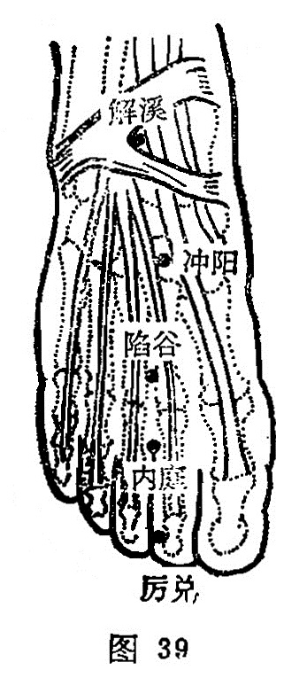

##### 内庭

〔定位〕足背二、三趾间缝纹端(图39)。

〔解剖〕有足背静脉网；当足背内侧皮神经及第二支分出趾背神经分歧处。

〔功能〕清降胃火，通涤腑气。

〔主治〕齿痛，口㖞，咽痛，喉痹，鼻衄，泄痢，便秘，热病， 足背肿痛。

〔刺灸〕直刺0.3〜0.5寸。

〔讲述〕出《灵枢•本输》。本穴位于历兑之后；兑为口、为门 (《易经》），历兑为大门，此穴为庭门，因名。穴属胃经所溜荥水穴，具有清降胃火，宣泄阳明之效。故凡胃火炽盛、以及阳明炽热循经上扰头面、咽喉、口齿之疾，刺泻能降胃火，散邪热；补之能振奋胃阳。《甲乙》：治四肢厥逆，手足闷者，使人久持之，厥热，胫痛，腹胀，皮痛，善伸数欠，恶心与木音，下齿痛。《千金》：主食不化，不嗜食，挟脐急。《天星十二穴》：能治四肢厥，喜静恶闻声，瘾疹咽喉痛，数欠及牙痛，疟疾不思食，耳鸣针便清。因胃经循行自头至足，下循鼻外，入上齿龈内；其支者沿喉咙入缺盆，下膈膜，入属胃腑，故凡胃火上炽，阳明积热，上攻咽喉，齿痛咽肿喉痛者，针泻内庭，上病下取，可清热开郁，导火下行而获止痛消肿之效。临床常配合谷治胃火齿痛；配复溜治阴虚齿痛。配合谷、三阴交清胃凉血，治龈肿口臭；配外关、公孙降火平呃，治热呃；配中脘、三里降逆止呕，治胃热呕吐；配支沟、上巨虚泻火通便，治便秘；配神门清心泻火宁心，治癫乱。配内关、曲池治腹痛泄泻；配太溪、仆参治足痠麻木。

