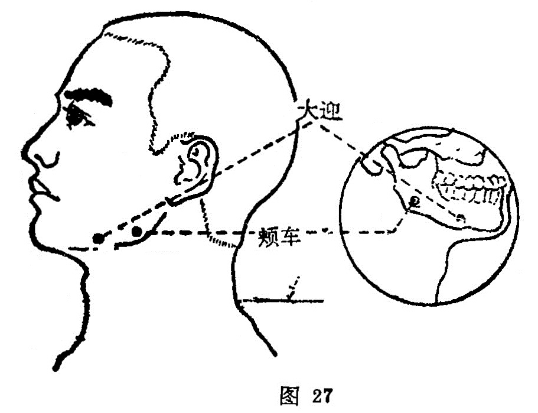

##### 颊车

〔定位〕下颌角前上方一横指凹陷中，咀嚼时咬肌的隆起处 （图27）。

〔解剖〕在咬肌中，有咬肌动静脉；布有三叉神经第三支的咬肌神经，及由颈丛来的耳大神经。

〔功能〕开关活络，疏风止痛。

〔主治〕口眼㖞斜，颊肿，齿痛，口噤不语，中风痰壅，痄腮。

〔刺灸〕直刺0. 3〜0.5 寸，或向地仓方向斜刺，平刺0.5〜1.2 寸，可灸。

〔讲述〕出《素问•气府论》。别称牙车、曲牙、鬼府、机关。面两侧称颊，下颌骨古称颊车骨，该骨总载诸齿，能咀食物，如车轮转动，穴当其处，因名。本穴主要用治肩部疼痛，口噤，颊 肿等。临床常配颧髎治口僻痛，恶风寒不可以咀；配人中、百会、承浆、合谷治中风口噤不开；配内庭清泻胃火，治胃火牙痛；配太溪滋阴补肾，治肾虚牙痛；配翳风、合谷清泻郁热，消散壅滞治痄腮。

