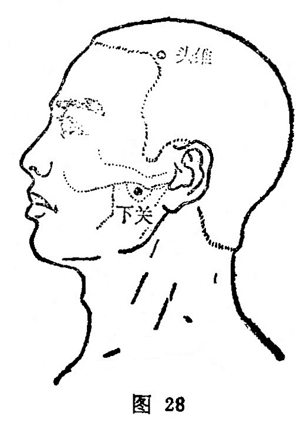

##### 头维

〔定位〕额角发际直上0.5寸（图28）。

〔解剖〕在颞肌上缘，帽状腱膜中，有颞浅动静脉的额支；布有耳颞神经支，上颌神经、颧颞神经及面神经颞支。

〔功能〕祛风泄火，清头明目。

〔主治〕眼痛，头痛，目眩，迎风流泪，面瘫。

〔刺灸〕平刺0.5〜1寸，不宜灸。

〔讲述〕见于《甲乙》。別称颡大。头指头部，维指角隅，穴当额角发际，为足阳明脉气所发，因名。本穴除主治头痛、目眩诸疾外，还可用治喘逆，烦满等症。《甲乙》：主寒热头痛如破，目痛如脱，喘逆，烦满，呕吐，流汗难言。《大成》：主目瞷，目风泪出，偏风，视物不明。配百会、太阳、率谷、合谷治偏头痛；配风池、角孙、睛明治目赤肿痛，视物不清；配大陵治头痛如破，目痛如脱；配晴明、临泣、风池治迎风流泪；配攒竹治目睑瞤动。

本穴属足少阳、阳明之会所，胃经支脉还系自系，深人目内；胆经别支系目系，合少阳于外眦，故头维善治头痛，目疾。

