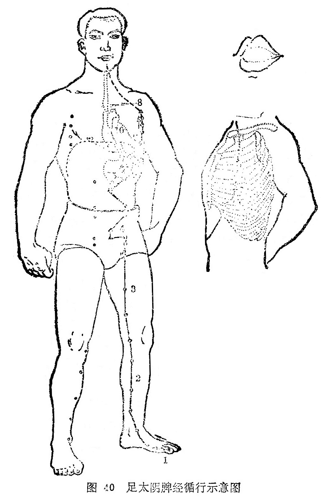

#### （二）本经证候

经证：舌根痛、僵硬，大腿及膝关节内侧肿胀、发冷，足大趾不能运用（均属本经病）。

脏证：不欲食，嗳气，腹胀，痞块，身体沉重，大便溏泄，水肿，黄疸（均属本脏病）。呕吐、胃痛（胃病）。心烦，心下痛，失眠（心病)。正如经文所述：是动则病舌本强，食则呕，胃脘痛，腹胀善噫，得后与气，则快然如衰，身体皆重。是主脾所生病者，舌本痛，体不能动摇，食不下，烦心，心下急痛，溏瘕泄，水闭，黄疸，不能卧，强立，股膝内肿，厥，足大指不用（《灵枢·经脉》)。

图解：脾足太阴之脉：①起于大趾之端，循趾内侧白肉际，过核骨后，上内踝前廉，②上腨内，循胫骨内，交出厥阴之前，③上膝股内前廉，④入腹，⑤属脾，⑥络胃，⑦上膈，⑧挟咽，⑨连舌本，散舌下，其支者，⑩复从胃别，上膈，注心中（《灵枢·经脉》)。
