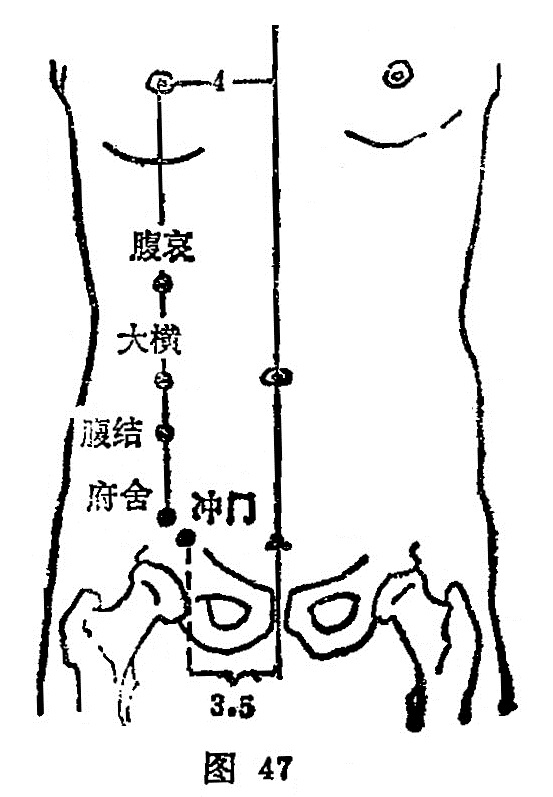

##### 腹结

〔定位〕在大横穴下1.3寸，任脉旁开4寸（图47）。

〔解剖〕有腹内外斜肌及腹横肌；布有第11肋间动、静脉和肋间神经。

〔功能〕行气血，调肠腑。

〔主治〕绕脐腹痛，疝气，泄痢。

〔刺灸〕直刺0.7～1.2寸，可灸。

〔讲述〕见于《甲乙》。别称腹屈、肠结、肠窟。腹，指腹部；结，有聚的含意，本穴主治绕脐作痛，气结胸腹，因名。本穴主要用治腹痛，泄痢，疝痛之疾。《千金》：治绕脐痛抢心。《铜人》：治绕脐痛，上冲抢心，腹寒泄痢，咳逆。临床常配天枢调肠胃，止泻痢；配行间舒肝气，治胁痛抢心。

