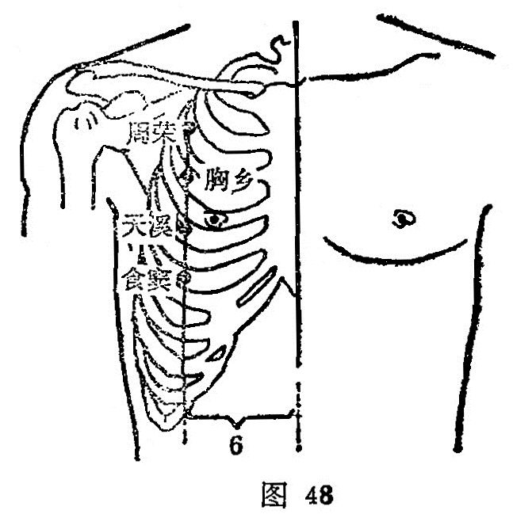

##### 天溪

〔定位〕膻中（任脉）旁开6寸，第4肋间隙中（图48）。

〔解剖〕在胸大肌外下缘，前锯肌中，深层有肋间内外肌，有胸外侧动、静脉之支，胸腹壁动、静脉，布有第四肋间神经。

〔功能〕宽胸，通乳。

〔主治〕胸痛，咳嗽，乳痈，乳汁少。

〔刺灸〕平刺或斜刺0.5～0.8寸，可灸。

〔讲述〕见于《甲乙》。天指上部，小水流出日溪。穴当乳旁外侧，主治乳少，乳痈诸疾，针此则乳汁涌出，犹如天然之溪流，因名。本穴除主胸中满痛，咳逆上气外，主要用于乳少，乳肿，有散瘀通乳之效。临床常配少泽治乳汁不足；配丰隆平喘止咳。

