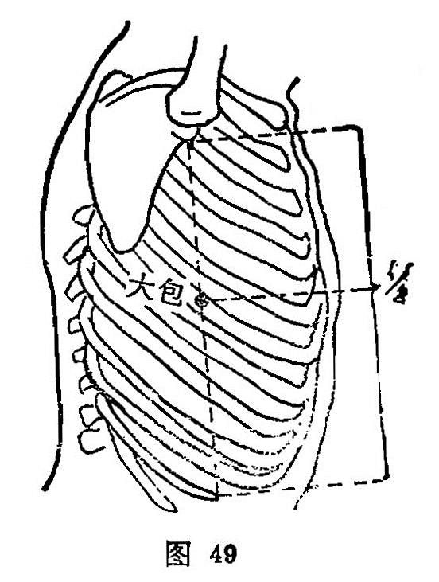

##### 大包

〔定位〕侧卧举臂，在腋下6寸，腋中线上，第6肋间隙中（图49）。

〔解剖〕有前锯肌，胸背动、静脉及第6肋间动、静脉，布有第6肋间神经，当胸长神经直系的末端。

〔功能〕统诸络，束筋骨，利胸膈。

〔主治〕胸胁痛，气喘，全身疼痛，四肢无力。

〔刺灸〕平刺或斜刺0.5～0.8寸，可灸。

〔讲述〕出《灵枢·经脉》。大有广阔之意；总统、概括为包。因穴为脾经大络，总统阴阳诸经，由此灌溉五脏四肢，因名。本穴除主全身络脉疾病外，主要用于胸胁痛。《灵枢·经脉》：治实则心尽痛，虚则百节皆纵，此脉若罗络之血者，皆取之脾之大络脉也。《大成》：治胸胁中痛，喘气，实则身尽痛泻之，虚则百节皆纵补之。临床配郄门治心尽痛；配期门、肝俞治胸胁痛。取本穴应侧卧举臂，以腋窝和第11肋骨端的直线作为12寸，当此中点，距乳头线旁4寸，于腋中线上取之，适当第6肋间隙中，恰在渊液下3寸。穴内部有肺下部，禁深刺。
