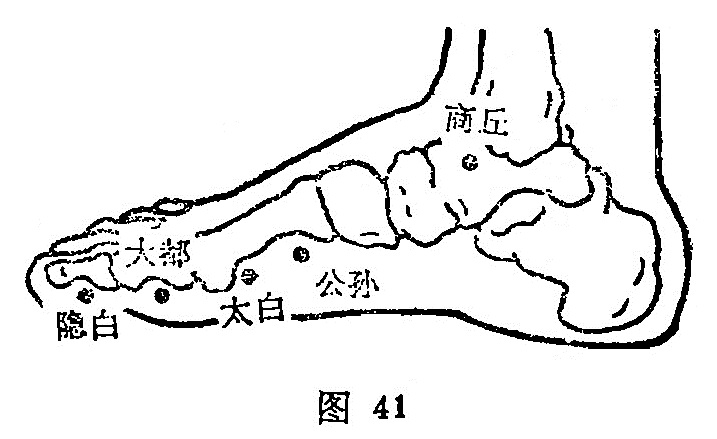

##### 公孙

〔定位〕第一跖骨底的前缘，赤白肉际处（图41）。

〔解剖〕在外展𧉯肌中，有跗内侧动脉及足背静脉网，在隐神经及腓浅神经处。

〔功能〕理脾胃，调冲脉。

〔主治〕心胸胃痛，呕吐，食不化，腹痛泄泻，痢疾，逆气里急。

〔刺灸〕直刺0.5～0.8寸，可灸。

〔讲述〕出《灵枢·经脉》。公，有本原之意，孙者支系。穴属脾络，以其正脉为公为本，支络为系为孙，因名。穴属本经络穴，又系八脉交会通于冲脉，故有理脾胃，调冲脉之效。《甲乙》：治实则肠中切痛，厥，头面肿起，烦心，狂，多饮；虚则鼓胀，腹中气大满，热病不嗜卧，霍乱。《八法歌》：九种心痛涎闷，结胸翻胃难停，酒食积聚胃肠鸣，水食气疾膈病，脐痛腹疼胁胀，肠风疟疾心疼，胞衣不下血迷心，泄泻公孙立应。临床常配内关治心胸疾；配内庭、历兑治久疟不食；配脐中四边穴治腹泻；配章门治腹胀。配三里、阴陵泉、曲泽、委中放血，祛湿化浊，治霍乱吐泻；配天枢、中脘、艾灸神阙，温阳散寒，治寒霍乱。总之，脾经从公孙别出，走入足阳明经，加之公孙通于冲脉，而冲脉起于气街，并少阴之经挟脐上行，至胸中而散，当冲脉之气失调，逆气而里急，冲逆攻痛，刺灸公孙，可收降逆平冲之效。

