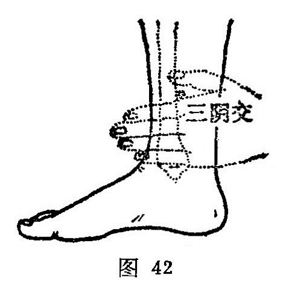

##### 三阴交

〔定位〕内踝上3寸，胫骨内侧面后缘取穴；或当内踝尖上四横指处（图42、43）。

〔解剖〕在胫骨后缘和比目鱼肌之间，深层有胫后动、静脉；布有小腿内侧皮神经，深层后方有胫神经。

〔功能〕调脾胃，益肝肾。

〔主治〕脾胃虚弱，腹胀肠鸣，完谷不化，月经不调，带下不孕，阴挺滞产，产后血晕，恶露不行，遗精阳萎，疝气遗尿，小便不利，失眠心悸。

〔刺灸〕直刺0.5～1寸，可灸。

〔讲述〕见于《甲乙》。别称承命、太阴。会处为交，《针灸问对》谓足之三阴，从足走腹，太阴脾经循内踝上直行，厥阴循内踝交入太阴后，少阴肾经循内踝后交出太阴之前。此处为足三阴脉交会所，因名。本穴除主治腹胀肠鸣，大便溏泄脾胃疾患外，主要用于经、带、不孕、难产之疾。《千金》：治女人漏下赤白，血崩，难产，月水不禁，横生胎动、妇人下血泄痢，赤白漏下。《外台》：主虚则腹满，肠鸣溏泄，食饮不化，脾胃肌肉痛。临床常配[归来](https://www.gmzyjc.com/read/zjs/zjs3.1.1-3-0.1.3.3.29.md)、[太冲](https://www.gmzyjc.com/read/zjs/zjs3.1.9-12-0.0.4.3.3.md)治疝气偏坠；配[关元](https://www.gmzyjc.com/read/zjs/zjs3.2.1-0.1.1.3.4.md)治夜尿；配[血海](https://www.gmzyjc.com/read/zjs/zjs3.1.4-6-0.0.1.3.10.md)、[气海](https://www.gmzyjc.com/read/zjs/zjs3.2.1-0.1.1.3.6.md)治月经不调、痛经；配[中脘](https://www.gmzyjc.com/read/zjs/zjs3.2.1-0.1.1.3.11.md)、[气海](https://www.gmzyjc.com/read/zjs/zjs3.2.1-0.1.1.3.6.md)治月经过多；配[关元](https://www.gmzyjc.com/read/zjs/zjs3.2.1-0.1.1.3.4.md)治经后腹痛；配[阴陵泉](https://www.gmzyjc.com/read/zjs/zjs3.1.4-6-0.0.1.3.9.md)治飧泄；配[气海](https://www.gmzyjc.com/read/zjs/zjs3.2.1-0.1.1.3.6.md)治白浊、遗精；配[神门](https://www.gmzyjc.com/read/zjs/zjs3.1.4-6-0.0.2.3.7.md)治失眠；配[合谷](https://www.gmzyjc.com/read/zjs/zjs3.1.1-3-0.1.2.3.4.md)能催产。《铜人》谓妊娠不可刺。
