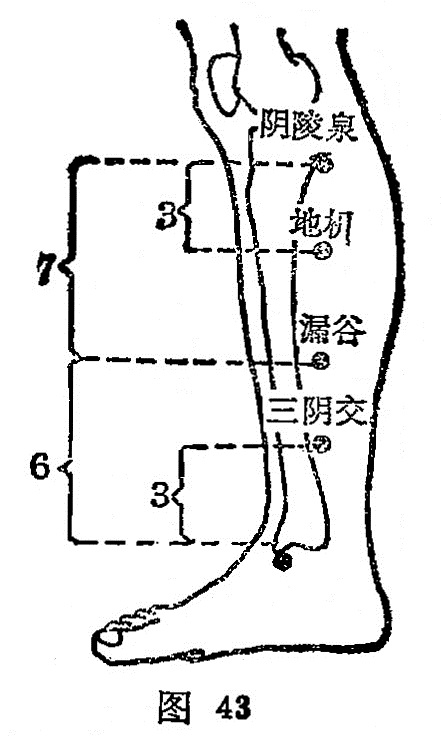

##### 地机

〔定位〕阴陵泉下3寸，当阴陵泉与三阴交的连线上取穴（图43）。

〔解剖〕在胫骨后缘与比目鱼肌之间，前方有大隐静脉，及膝最上动脉，深层有胫后动静脉；布有小腿内侧皮神经，深层后方有胫神经。

〔功能〕和脾理血，调燮胞宫。

〔主治〕月经不调，痛经，遗精，腹胀，纳呆，水肿，小便不利。

〔刺灸〕直刺0.5～1寸，可灸。

〔讲述〕见于《甲乙》。别称脾舍，地箕。地，指土，在此引伸为脾土；机，有变化之意。本穴主治妇人月事改常，精血不足，生殖不能，刺此可使气血充盛，生殖畅旺，犹如大地得正气，化生万物一样，因名。《铜人》：治女子血瘕，丈夫溏泄，腹胁气胀，水肿。《大成》：治精不足，女子癥瘕。《百症赋》：抑又论妇人经事改常，自有地机、血海。本穴能治月经不调，是因地机为脾之郄，脾主统血，刺灸脾郄，可以引血归脾，补脾摄血，而收调气养血之功。

