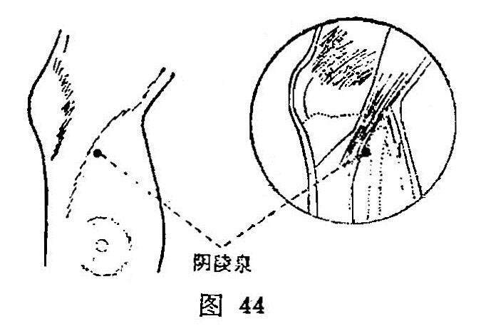

##### 阴陵泉

〔定位〕胫骨内侧髁下缘凹陷中（图44）。

〔解剖〕在比目鱼肌起点上方，前方有大隐静脉，膝最上动脉，深层有胫后动，静脉；布有小腿内侧皮神经本干，最深层有胫神经。

〔功能〕健脾利水，通利三焦。

〔主治〕腹胀，水肿，小便不利，失禁，黄疸，膝肿。

〔刺灸〕直刺0.5～1.2寸，可灸。

〔讲述〕出《灵枢·热病》。别称阴之陵泉、阴陵。突起为陵，穴属合水，位居膝下内侧，又为脾经腧穴，脾为阴中之阴，膝高突起似陵，水出于泉，因名。本穴除主腹胀，泄泻以及膝痛之疾外，主要用于水肿，小便不利，有通利三焦，开通[水道](https://www.gmzyjc.com/read/zjs/zjs3.1.1-3-0.1.3.3.28.md)之效。《千金》：主心下满寒中小便不利，洞泄不化。《金鉴》：治胁腹胀满，阴痛，足膝红肿，小便不通。《玉龙歌》：膝盖红肿鹤膝风，阳陵二穴亦堪攻，阴陵针透尤收效，红肿全消见异功。《百症赋》：阴陵[水分](https://www.gmzyjc.com/read/zjs/zjs3.2.1-0.1.1.3.8.md)去水肿之脐盈。本穴所以能通利三焦，是因穴属脾经合穴，阴合属水，与水经的肾和膀胱有密切联系，故能宣泄水液，通利小便。临床常配[水道](https://www.gmzyjc.com/read/zjs/zjs3.1.1-3-0.1.3.3.28.md)通淋利小便。配[水分](https://www.gmzyjc.com/read/zjs/zjs3.2.1-0.1.1.3.8.md)、[中极](https://www.gmzyjc.com/read/zjs/zjs3.2.1-0.1.1.3.3.md)、[足三里](https://www.gmzyjc.com/read/zjs/zjs3.1.1-3-0.1.3.3.36.md)、[三阴交](https://www.gmzyjc.com/read/zjs/zjs3.1.4-6-0.0.1.3.6.md)治癃闭，腹水；配[涌泉](https://www.gmzyjc.com/read/zjs/zjs3.1.7-8-0.0.2.3.1.md)治小肠连脐痛；配[关元](https://www.gmzyjc.com/read/zjs/zjs3.2.1-0.1.1.3.4.md)治气癃尿黄；配[隐白](https://www.gmzyjc.com/read/zjs/zjs3.1.4-6-0.0.1.3.1.md)治胸中热暴泄；配[承山](https://www.gmzyjc.com/read/zjs/zjs3.1.7-8-0.0.1.3.57.md)治心胸满不思食；透刺[阳陵泉](https://www.gmzyjc.com/read/zjs/zjs3.1.9-12-0.0.3.3.34.md)治膝肿鹤膝风。
