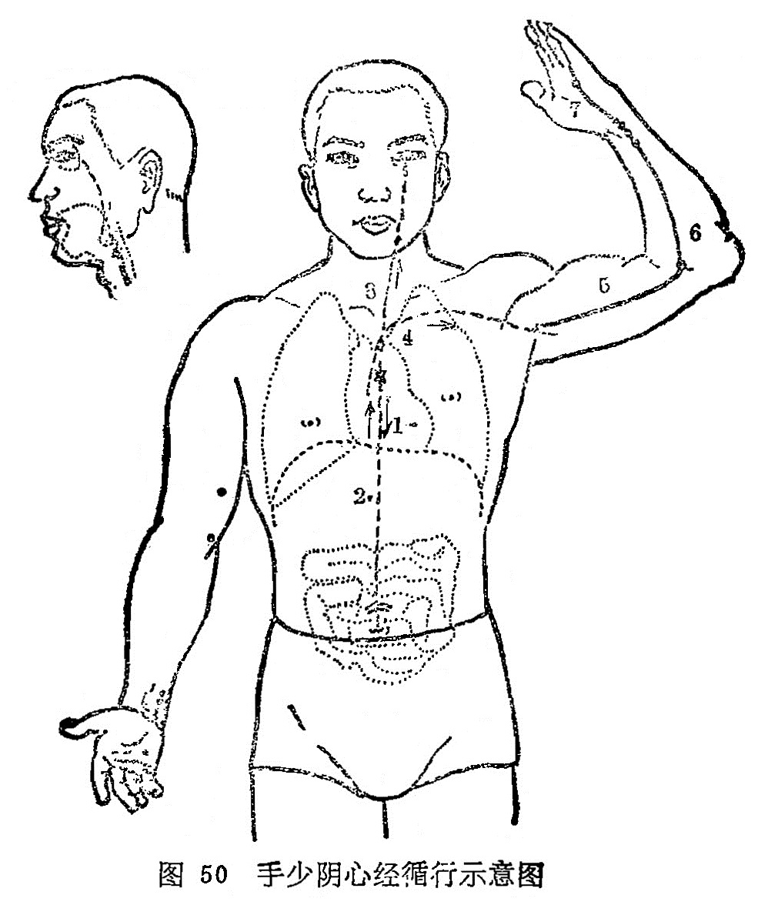

#### （一）分布络属

分布径路：受脾经之支脉，起于心中，出属心系（心与其它．脏器相联系的部位），向下穿过膈肌，联络小肠。

它的支脉，从心系向上，沿着食道上端的两旁，连系于目系（眼球联系于脑的部位）。

它的直行主干，从心系上行于肺脏，再向下浅出腋下，沿上肢内侧后缘，到手掌后豆骨处，进入掌中，沿着小指的桡侧，出小指桡侧端（少冲），与手太阳小肠经相接（图50）。

络属脏腑：属心，络小肠。

经过器官：心系，咽（食道），目系，肺脏。

本经腧穴：

五是心经手少阴，极泉腋窝动脉牵。

青灵肘上三寸觅，少海肘后五分连。

灵道掌后一寸半，通里腕后一寸间。

阴郄去腕五分是，神门锐骨端内缘。

少府小指本节后，少冲小指内侧边。

 

图解：心手少阴之脉，①起于心中，出属心系，②下膈，络小肠，其支者，③从心系上挟咽。其直者，④复从心系却上肺，下出腋下，⑤循臑内后廉，行手太阴、心主之后，⑥下肘内，循臂内后廉，抵掌后锐骨之端，⑦入掌内后廉，循小指之内出其端（《灵枢·经脉》）。
