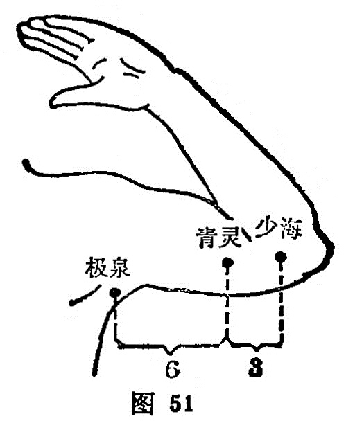

##### 极泉

〔定位〕上臂外展，在腋窝正中，当腋动脉内侧取之（图51）。

〔解剖〕在胸大肌的外下缘，深层为喙肱肌，外侧为腋动脉；布有尺神经，正中神经，前臂内侧皮神经及臂内侧皮神经。

〔功能〕疏筋活血。

〔主治〕心痛，胁痛，咽干，烦渴，腋臭，瘰疬，肘臂冷痛，上肢不遂。

〔刺灸〕上肢外展，避开腋动脉向上斜刺0.3～0.5寸，可灸。

〔讲述〕见于《甲乙》。别称臂内。尽处为极，水之高而有源者为泉，泉又有凹陷之意。心主血脉，似水之流，穴当心经最高极点之处，又深藏腋下凹处，为极上之泉，因名。本穴除主肘臂冷痛，上肢不遂外，还可用于心痛，胁痛。《外台》：治心腹痛，干呕，哕，是动则病嗌干，心痛渴而欲饮，为臂厥。是主心所生病者，目黄胁痛，腰臂内后廉痛，掌中热痛。《大成》：主臂肘厥寒，四肢不收，心痛干呕，烦渴，目黄，胁满痛，悲愁不乐。临床常配侠白治心痛，干呕烦满；配阴交、漏谷治胸痹，配灵道治悒悒寡欢；配外关、阳陵泉治胁肋痛。刺此穴应将手平举，上肢外展，腋下多汗，应严密消毒，避开腋下动脉，向上斜刺。

