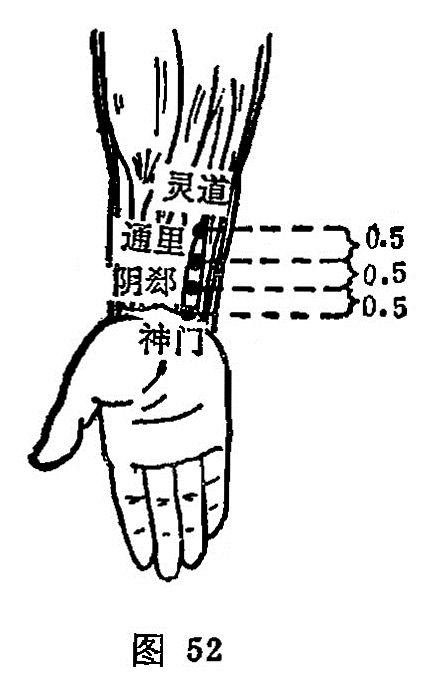

##### 阴郄

〔定位〕在尺侧腕屈肌腱的桡侧缘，腕横纹上0.5寸处（图52）。

〔解剖〕同通里穴。

〔功能〕滋养阴血，固表安神。

〔主治〕骨蒸盗汗，吐衄血，心痛惊恐。

〔刺灸〕直刺0.3～0.5寸，可灸。

〔讲述〕见于《甲乙》。别称少阴郄。郄有孔、空之意，是气血聚会的深隙处，穴属手少阴之郄，因名阴郄。本穴除用治心悸，惊恐，心痛之疾外，主要用于骨蒸盗汗，吐衄血诸疾。《玉龙经》：治失音难言，衄血，盔汗，小儿骨蒸。《标幽赋》：泻阴郄止盗汗，治小儿骨蒸。本穴所以能止盗汗，是因心藏神，汗为心液，骨蒸盗汗多为阴亏火旺，血液外泄所致，故泻心之郄，目的在于收敛浮阳，固摄心液，而达止汗之功效。临床常配曲泽、大陵治心痛；配后溪止盗汗；配二间治寒傈恶寒。配百劳、肺俞治咳血，阴虚发烧，夜间盗汗；配定喘治喘息。

