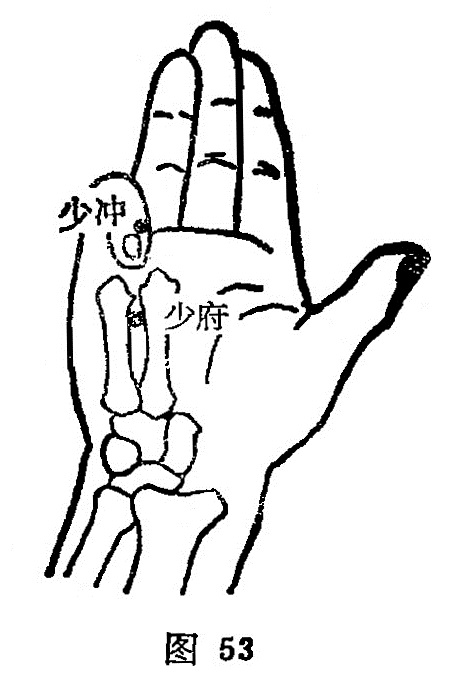

##### 少府

〔定位〕手掌第四、五掌骨之间。在仰掌屈指时，当小指尖所指处，横与[劳宫](https://www.gmzyjc.com/read/zjs/zjs3.1.9-12-0.0.1.3.8.md)穴相平（图53）。

〔解剖〕在第四，五掌骨间，有第四蚓状肌，屈指深浅肌腱，深部为骨间肌，有指掌侧总动静脉，为第四指掌侧总神经分布处。

〔功能〕清心导火，行气活血。

〔主治〕心悸，心痛，掌中热，小指挛痛，悲笑，惊恐，阴痒，阴痛，阴挺，小便不利。

〔刺灸〕直刺0.3～0.5寸，可灸。

〔讲述〕见于《甲乙》。聚处为府，本穴属手少阴心经，为经气所聚之处，因名。本穴除治小指拘挛，掌中热之疾外，还可用治心悸，心痛。《玉龙经》：治虚悲忧，少气，心痛，实癫痫谵语，臂痛，背疽初发。《金鉴》：治咳疟久不愈，臂酸，肘腋挛急，胸中痛，及妇人阴挺、阴痒、阴痛，男子遗尿、偏坠。临床常配[内关](https://www.gmzyjc.com/read/zjs/zjs3.1.9-12-0.0.1.3.6.md)、[心俞](https://www.gmzyjc.com/read/zjs/zjs3.1.7-8-0.0.1.3.15.md)治心悸；配三里治小便不利：配[关元](https://www.gmzyjc.com/read/zjs/zjs3.2.1-0.1.1.3.4.md)、[足三里](https://www.gmzyjc.com/read/zjs/zjs3.1.1-3-0.1.3.3.36.md)治尿闭；配[蠡沟](https://www.gmzyjc.com/read/zjs/zjs3.1.9-12-0.0.4.3.5.md)治咽中有气如息肉状；配[三阴交](https://www.gmzyjc.com/read/zjs/zjs3.1.4-6-0.0.1.3.6.md)、[关元](https://www.gmzyjc.com/read/zjs/zjs3.2.1-0.1.1.3.4.md)治遗尿；配[关元](https://www.gmzyjc.com/read/zjs/zjs3.2.1-0.1.1.3.4.md)、[会阴](https://www.gmzyjc.com/read/zjs/zjs3.2.1-0.1.1.3.1.md)治阴部湿疹瘙痒。本穴属荥火，功同[神门](https://www.gmzyjc.com/read/zjs/zjs3.1.4-6-0.0.2.3.7.md)，刺之能开通心气。且心之经脉，下络小肠，故刺之能导火下行，通利小溲，对湿热引起的尿闭、阴痒皆可刺之。

