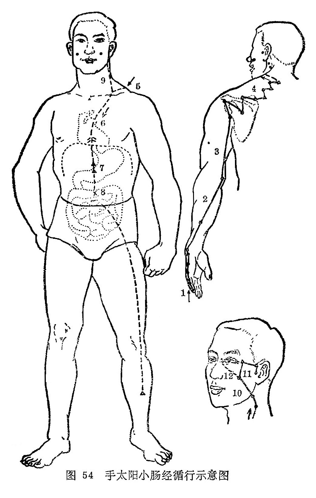

#### （一）分布络属

分布径路：受心经的支脉，从手小指尺侧端（少泽）起始，沿手掌尺侧缘，上行到腕部，出尺骨茎突，向上沿着尺骨下缘，到肘部尺骨鹰嘴和肱骨内上髁的中间，再向上沿着上臂外侧后面，出行到肩关节后面、绕行肩胛部，交会于督脉的大椎，再向前进入缺盆，深入体腔，联络心脏，沿着食道，穿过膈肌，到达胃部，下行归属于小肠。

它的上行支脉，从缺盆出来，沿着颈部浅行，上达面颊，至外眼角后，退回来进入耳中（听宫）。

另从面颊部分出一支，上行目眶下，抵于鼻旁，至目内眦（睛明），与足太阳膀胱经相接，然后斜行络于颧骨部（图54）。

络属脏腑：属小肠，络心。

经过器官：咽（食道），眼，耳，鼻，联络胃。

本经腧穴：

六小肠经手太阳，臂外后缘尺侧详。

少泽小指外甲角，前谷泽后节前扬。

后溪握拳节后取，腕骨腕前骨陷当。

阳谷锐骨下陷讨，养老转手髁空藏。

支正腕后上五寸，小海肘后两骨乡。

肩贞腋缝上一寸，再上寸半臑俞量。

天宗神道旁六寸，秉风胛上骨边求。

曲垣平乘内寸五，陶道旁三外俞张。

大椎旁二肩中俞，天窗扶后大筋厢。

天容耳下曲颊后，颧髎面鸠下廉乡。

听宫二穴归何处，耳小瓣前陷中央。

图解：小肠手太阳之脉，①起于小指之端，循手外侧，上腕，出踝中，②直上循臂骨下廉，出肘内侧两骨之间，③上循臑外后廉，出肩解，④绕肩胛，交肩上，⑤入缺盆，⑥络心，循咽下膈，⑦抵胃，⑧属小肠。其支者，⑨从缺盆循颈，⑩上颊，至目锐眦。⑪却人耳中，其支者，⑫别颊上颛，抵鼻，至目内眦（《灵枢·经脉》）。
