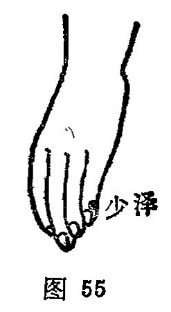

##### 少泽

〔定位〕小指尺侧指甲角旁约0.1寸处（图55）。

〔解剖〕有指掌侧固有动、静脉，指背动脉形成的动、静脉网；布有指背神经和指掌侧固有神经。

〔功能〕开窍泄热，利咽通乳。

〔主治〕热病，头痛，无汗，昏厥，乳痈，乳汁少，咽痛，小指麻木。

〔刺灸〕斜刺0.1寸，或用三棱针点刺出血，可灸。

〔讲述〕出《灵枢·本输》。别称小吉。少指手太阳小肠经，小肠之脉主液，穴在小指，为小肠经井穴，井当润泽，经气始出，因名。该穴为十二井穴之一，除主热病，昏厥，咽喉肿痛外，还有通乳，增加乳汁之效。《甲乙》：主振寒，小指不用，寒热汗不出，头痛，喉痹，舌卷。《玉龙经》：治项急，咳嗽，喉痹，舌疮，目赤，妇人无乳并乳痈。《图翼》：疗妇人无乳，先泻后补。临床常配[肩井](https://www.gmzyjc.com/read/zjs/zjs3.1.9-12-0.0.3.3.21.md)、[委中](https://www.gmzyjc.com/read/zjs/zjs3.1.7-8-0.0.1.3.40.md)治乳痈；配[肝俞](https://www.gmzyjc.com/read/zjs/zjs3.1.7-8-0.0.1.3.18.md)治目翳昏花；配[肺俞](https://www.gmzyjc.com/read/zjs/zjs3.1.7-8-0.0.1.3.13.md)、[膻中](https://www.gmzyjc.com/read/zjs/zjs3.2.1-0.1.1.3.16.md)止哮喘；配[鱼际](https://www.gmzyjc.com/read/zjs/zjs3.1.1-3-0.1.1.3.10.md)、[列缺](https://www.gmzyjc.com/read/zjs/zjs3.1.1-3-0.1.1.3.7.md)治咳嗽；配[液门](https://www.gmzyjc.com/read/zjs/zjs3.1.9-12-0.0.2.3.2.md)、[手三里](https://www.gmzyjc.com/read/zjs/zjs3.1.1-3-0.1.2.3.10.md)治上肢痛麻；配[劳宫](https://www.gmzyjc.com/read/zjs/zjs3.1.9-12-0.0.1.3.8.md)治心痛翻胃；配[合谷](https://www.gmzyjc.com/read/zjs/zjs3.1.1-3-0.1.2.3.4.md)、[三阴交](https://www.gmzyjc.com/read/zjs/zjs3.1.4-6-0.0.1.3.6.md)、[血海](https://www.gmzyjc.com/read/zjs/zjs3.1.4-6-0.0.1.3.10.md)能通调乳腺，促使乳汁的分泌；配[间使](https://www.gmzyjc.com/read/zjs/zjs3.1.9-12-0.0.1.3.5.md)、[膻中](https://www.gmzyjc.com/read/zjs/zjs3.2.1-0.1.1.3.16.md)能行气通乳；配[脾俞](https://www.gmzyjc.com/read/zjs/zjs3.1.7-8-0.0.1.3.20.md)能补脾胃，使生化有源，治气血不足，不能生乳汁之疾。凡气机不畅，乳房胀硬而痛，乳汁不行者配[期门](https://www.gmzyjc.com/read/zjs/zjs3.1.9-12-0.0.4.3.14.md)、[间使](https://www.gmzyjc.com/read/zjs/zjs3.1.9-12-0.0.1.3.5.md)解郁理气，而乳汁通畅；凡阳明热盛，乳房肿痛，配[曲池](https://www.gmzyjc.com/read/zjs/zjs3.1.1-3-0.1.2.3.11.md)、[内庭](https://www.gmzyjc.com/read/zjs/zjs3.1.1-3-0.1.3.3.44.md)退热消肿，则乳汁可行。本穴所以能治乳疾，是因小肠与心有表里关系，心经支脉，上入腋，交太阴，挟乳里，结胸中；加之心主血脉，乳汁源于气血而化生，刺[少泽](https://www.gmzyjc.com/read/zjs/zjs3.1.4-6-0.0.3.3.1.md)能调心气，通血脉，终收通乳及增加乳汁的功效。治乳病宜用毫针向上横刺1分。用补法患者可觉乳房胀满或欲行乳汁；用泻法可觉乳房有舒畅感。治昏厥、发烧，可点刺出血。
