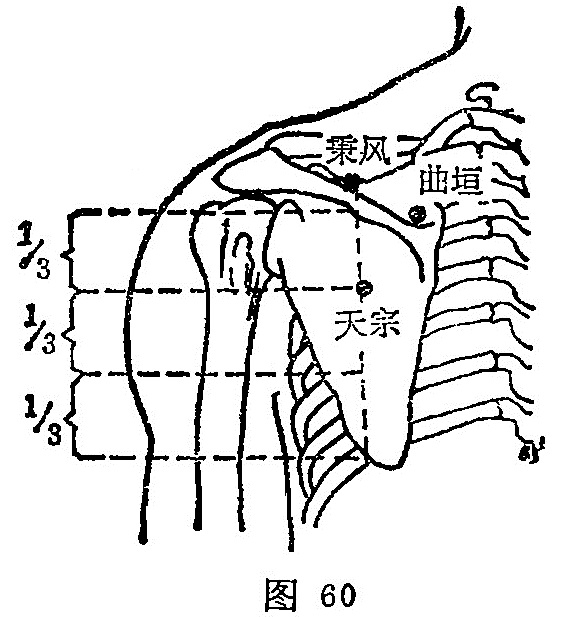

##### 曲垣

〔定位〕在肩胛冈上窝内侧凹陷中，约当臑俞与第二胸椎棘突连线的中点取穴（图60）。

〔解剖〕在斜方肌和冈上肌中；有颈横动、静脉降支，深层为肩胛上动、静脉肌支；布有第二胸神经后支外侧皮支，副神经，深层为肩胛上神经肌支。

〔功能〕舒筋，散风。

〔主治〕肩胛部拘急疼痛。

〔刺灸〕斜刺0.3～0.5寸。可灸.

〔讲述〕见于《甲乙》。曲同屈，有弯的含意；垣指垣墙。穴当肩胛冈隆起处，是处弯曲如墙垣样，主治肩胛周痹，因名。《甲乙》：治肩胛周痹。《大成》：主肩痹热痛，气注肩胛，拘急痛闷。临床常配天宗、后溪、昆仑治肩背痛。

