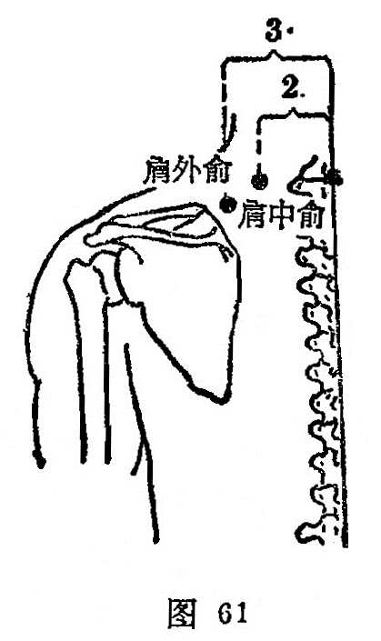

##### 肩外俞

〔定位〕在第一胸椎棘突下（[陶道](https://www.gmzyjc.com/read/zjs/zjs3.2.2-0.0.1.3.13.md))，旁开3寸处（图61)。

〔解剖〕表层为斜方肌，深层为肩胛提肌和小菱形肌；有颈横动、静脉；布有第一胸神经后支内侧皮支，肩胛背神经和副神经。

〔功能〕舒筋，散风。

〔主治〕肩背酸痛，颈项强急，肘臂痛。

〔刺灸〕斜刺0.3～0.5寸。可灸。

〔讲述〕见于《甲乙》。本穴位于[肩中俞](https://www.gmzyjc.com/read/zjs/zjs3.1.4-6-0.0.3.3.15.md)偏外方，主治肩胛外部疼痛，因名。《甲乙》：治肩背酸痛，颈项强急。《大成》：治肩胛痛，周痹寒至肘。配[天宗](https://www.gmzyjc.com/read/zjs/zjs3.1.4-6-0.0.3.3.11.md)治肩痛；配[曲池](https://www.gmzyjc.com/read/zjs/zjs3.1.1-3-0.1.2.3.11.md)治肩肘痛不举。

