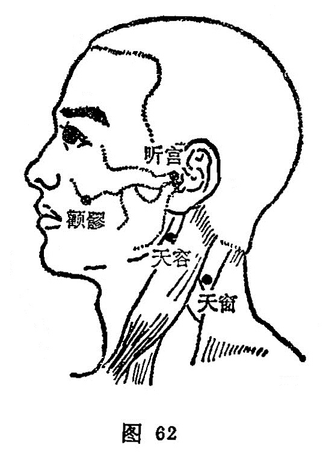

##### 天容

〔定位〕在下颌角后，当胸锁乳突肌前缘取穴（图62）。

〔解剖〕在下颌角后方，胸锁乳突肌停止部的前缘，二腹肌后腹的下缘；前为颈外浅静脉，颈内动、静脉；布有耳大神经的前支，面神经的颈支及副神经，其深层为交感神经干的颈上神经节。

〔功能〕聪耳利咽。

〔主冶〕耳聋耳鸣，咽痛喉痹，梅核气，呕逆，颊肿。

〔刺灸〕直刺0.5～0.8寸。可灸。

〔讲述〕出《灵枢·本输》。天指头，容指面容、容颜，因穴适当佩带耳环之处，主治耳聋、耳鸣，因名。《甲乙》：治头项痛肿不能言，耳聋，嘈嘈无所闻。《大成》：治喉痹寒热，咽中如梗，颈瘿项痛，不可回顾，不能言，耳聋耳鸣。临床常配[合谷](https://www.gmzyjc.com/read/zjs/zjs3.1.1-3-0.1.2.3.4.md)、[少商](https://www.gmzyjc.com/read/zjs/zjs3.1.1-3-0.1.1.3.10.1.md)治咽痛；配[翳风](https://www.gmzyjc.com/read/zjs/zjs3.1.9-12-0.0.2.3.17.md)、[听会](https://www.gmzyjc.com/read/zjs/zjs3.1.9-12-0.0.3.3.2.md)治疗耳聋。

