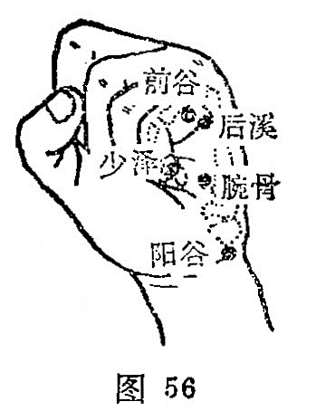

##### 后溪

〔定位〕握拳，第五掌指关节后，尺侧横纹头赤白肉际处（图56）。

〔解剖〕在小指展肌起点外缘，有指背侧动静脉，手背静脉网；布有尺神经之手背支。

〔功能〕散风舒筋，通督止痫。

〔主治〕头项颈肩疼痛，耳聋，鼻衄，咽痛，疟疾，癫狂痫癔，肘臂手指拘急疼痛，盗汗。

〔刺灸〕直刺0.5～0.8寸，可灸。

〔讲述〕出自《灵枢·本输》中。后与前相对；溪，原作谿，陷处为谿。穴属小肠经俞木穴，位于小指本节后横纹头处，较前谷高起，有小肉之会，因名。根据荥俞治外经的原则，后溪主治耳、目、颈项、肩胛、肘臂、腕及手指经脉所过处痛、麻。由于后溪为八脉交会穴之一，通于督脉，督脉贯脊，入络于脑；督之为病，脊强反折，故后溪又主头项强痛，颈项强直之疼病，狂痫，脏燥等症。临床常配环跳治腿痛；配阴郄治盗汗；配三里、曲池治臂痛，配风池、百会、太阳治头痛眩晕。凡后头痛，下连项部之太阳头痛，可配天柱、大抒通宣太阳经气，驱邪止痛，偏热用泻法，风寒加灸天柱。本穴所以能治头项痛，是因小肠经一条分支，循项与胱胱经相合；膀胱从巅顶经过颈项，故刺后溪以安然。另外后溪与督脉直接相连，督脉行于头项，故风寒湿热致使血行郁滞之头痛项强，不能回顾，取后溪有疏通经络，止痛散风之效。配大椎、间使宣阳疏表，祛邪止疟；凡热多寒少加泻内庭、合谷；但寒不热加补太溪，灸大椎。本穴所以能止疟，是因穴属俞木，小肠经属火，阳经之俞属木，穴为本经之母穴，刺用泻法，可收清热解表，故能截疟。配鸠尾、神门止痫定惊；凡脊强而厥加大椎、腰奇宣通督脉。本穴所以能止痫、狂，是因痫、狂多由痰、火，肝风上扰，或因惊、恐致使神不守舍，后溪为俞木穴，小肠属火，取泻后溪可减弱木盛，通经祛邪，舒筋清脑，熄风止痫，正所谓“发癫狂兮，凭后溪而疗理”。后溪用于落枕，凡左右不能转侧，取刺能宣畅太阳经脉之壅滞。

