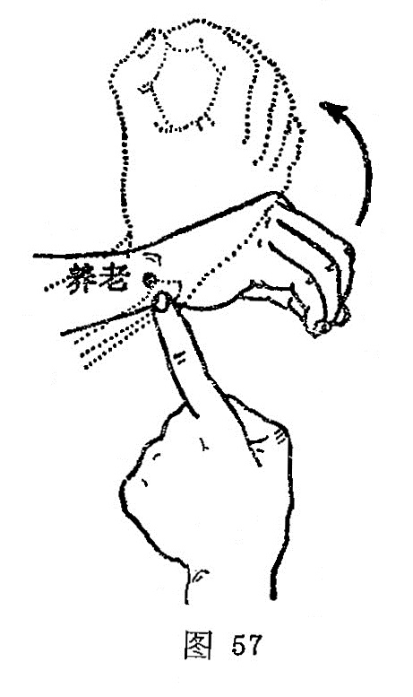

##### 养老

〔定位〕掌心朝胸，在尺骨茎突的高点处，凹陷骨缝中取穴（图57）。

〔解剖〕在尺侧腕伸肌腱和小指固有伸肌腱之间；有前臂骨间背侧动、静脉的末支；布有前臂背侧皮神经和尺神经手背支吻合支。

〔功能〕舒筋，明目。

〔主治〕视弱，肩背肘臂酸痛，无力。

〔刺灸〕直刺或斜刺0.5～0.8寸，可灸。

〔讲述〕见于《甲乙》。养有益的含意，本穴主治目视不明，耳闭不闻，肩欲折，臂如拔，手不能自上下，针此能舒筋明目，有益老人之健康，因名。《甲乙》：治肩痛欲折，臑如拔，手不能自上下。《大成》：治肩臂酸痛，肩欲折，臂如拔，手不能自上下，目视不明。临床常配天柱治目觉䀮䀮，配外关，阳池治腕下垂和疼痛；配肩贞治肩凝；配合谷、曲差治目视不明；配内关、膈俞治呃逆。因穴属手太阳之郄，为气血深聚之处，刺之能止疼痛，舒筋脉。由于小肠之脉至目锐眦，而心与小肠相表里，故凡心火上炎，剌小肠之郄可导火下行，泻除湿热，故能明目。
