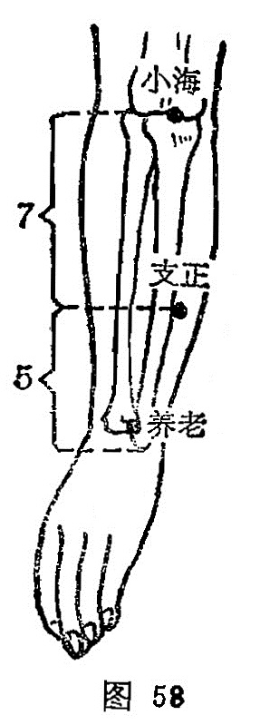

##### 支正

〔定位〕在腕上5寸，当[阳谷](https://www.gmzyjc.com/read/zjs/zjs3.1.4-6-0.0.3.3.5.md)与[小海](https://www.gmzyjc.com/read/zjs/zjs3.1.4-6-0.0.3.3.8.md)的连线上取穴（图58）。

〔解剖〕在尺侧腕伸肌的尺侧缘，有前臂骨间背侧动、静脉的末支；布有前臂内侧皮神经分支，深层挠侧有前臂间背侧神经。

〔功能〕解表，清热，宁神。

〔主治〕头痛，热病，目眩，癫狂，惊恐，心痛，消渴，以及肘臂手指挛痛，皮肤赘疣。

〔刺灸〕直刺或斜刺0.3～0.5寸，可灸。

〔讲述〕出《灵枢·经脉》。支，指离开；正，指正经。穴属本经之络，别走少阴，且心为五脏六腑之大主，经脉由此离开，络入心经，因名。本穴除主肘臂，手指挛痛，麻木外，还可用于心痛，消渴，多惊，善忘。《灵枢·经脉》：治实则节弛肘废，虚则生疣，小者如指，痂疥。《大成》：治风虚，惊恐悲愁，癫狂，五劳，四肢虚弱，肘臂挛难屈伸，手不握，十指尽痛。临床常配[曲池](https://www.gmzyjc.com/read/zjs/zjs3.1.1-3-0.1.2.3.11.md)治肘臂手指痛、麻，不能握物；配[三焦俞](https://www.gmzyjc.com/read/zjs/zjs3.1.7-8-0.0.1.3.22.md)治目眩头痛；配[飞阳](https://www.gmzyjc.com/read/zjs/zjs3.1.7-8-0.0.1.3.58.md)治目眩；配心原[神门](https://www.gmzyjc.com/read/zjs/zjs3.1.4-6-0.0.2.3.7.md)治饮水即消，背腹引腰作痛，眩晕仆倒，上咳吐，下泄气，热而心烦，好笑善恐，多惊。

