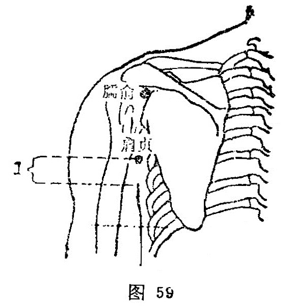

##### 肩贞

〔定位〕在肩关节后下方，上臂内收时，在腋后纹头上1寸处(图59)。

〔解剖〕在三角肌后缘，下层是大圆肌，有旋肩胛动、静脉；布有腋神经分支，最深部上方为桡神经。

〔功能〕祛风止痛，舒利关节。

〔主治〕肩胛痛，手臂痛麻不举，耳鸣耳聋，项疬。

〔刺灸〕直刺0.5～1寸，可灸。

〔讲述〕出《素问·[气穴](https://www.gmzyjc.com/read/zjs/zjs3.1.7-8-0.0.2.3.13.md)论》。贞指正，与邪相反；肩指肩部。穴在肩部，主治肩部疾患，针此能驱邪气，扶正气，使疾去肩端得以端正，因名。本穴除主肩疼，麻木不举外，还可用于耳鸣，项疬。《甲乙》：治寒热项疬，适耳无闻，引[缺盆](https://www.gmzyjc.com/read/zjs/zjs3.1.1-3-0.1.3.3.12.md)肩中热痛，麻痹不举。临床常配[肩髃](https://www.gmzyjc.com/read/zjs/zjs3.1.1-3-0.1.2.3.15.md)、[天宗](https://www.gmzyjc.com/read/zjs/zjs3.1.4-6-0.0.3.3.11.md)治肩痛，配[完骨](https://www.gmzyjc.com/read/zjs/zjs3.1.9-12-0.0.3.3.12.md)治耳鸣无闻。

