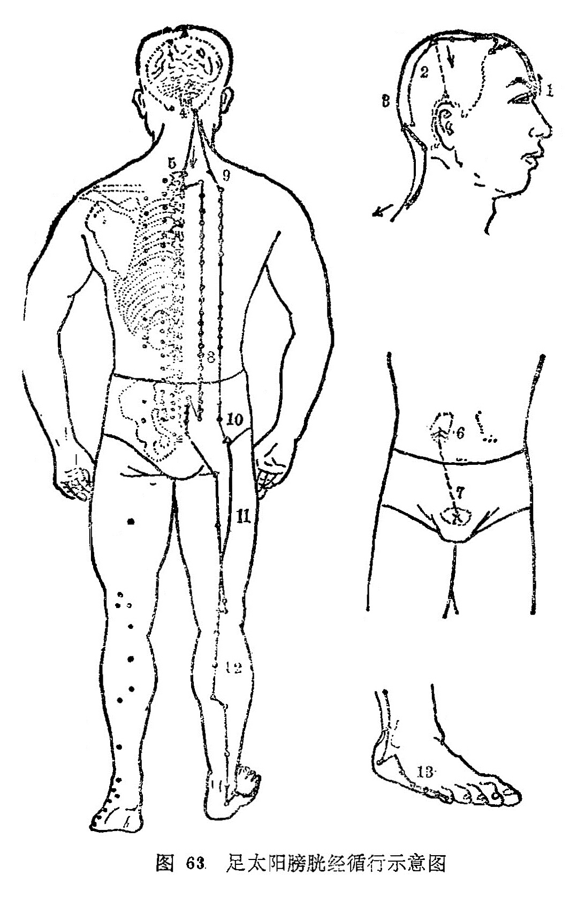

#### （一）分布络属 

分布径路：受小肠经之交，从鼻根部内眼角起始，向上到达额部，在头顶部左右相交。  

它的分支，从头顶到耳上角部。    

它的主干，从头顶部向下进人颅腔，联络脑，回出来左右分开下行到项部，沿肩胛内侧，脊柱两旁，到达腰部，进入脊柱两旁的肌肉，深入体腔，联络肾脏，归属膀胱。

外行的一支、从腰中继续沿着脊柱两旁下行，贯串臀部、进入腘窝中。

它的另一条支脉，自项向下，从肩膊内左右分开下行，穿过 肩胛骨内缘，向下经过股骨大转子部，沿着髋关节外侧，大腿后 侧下行、同前面的支脉在腘窝中相合，然后下行穿过腓肠肌，出 走于外踝的后面，沿足跖外侧缘，到足小趾外侧端，交给足少阴 肾经。

本经脉气，从[委中](https://www.gmzyjc.com/read/zjs/zjs3.1.7-8-0.0.1.3.40.md)合入于膀胱，又从[委阳](https://www.gmzyjc.com/read/zjs/zjs3.1.7-8-0.0.1.3.39.md)合入于三焦。

本经背部经脉，其脉气按相应脊椎的背腧穴和督脉相通，并深入体腔，通连体腔内的各脏腑器官。    

络属脏腑：属膀胱，络肾。

经过器官：眼，鼻，联系脑及体腔内其它脏腑。 

本经腧穴：   

七足太阳膀胱经，目内眦角是**[睛明](https://www.gmzyjc.com/read/zjs/zjs3.1.7-8-0.0.1.3.1.md)**。

 眉头陷中**[攒竹](https://www.gmzyjc.com/read/zjs/zjs3.1.7-8-0.0.1.3.2.md)**取，**[眉冲](https://www.gmzyjc.com/read/zjs/zjs3.1.7-8-0.0.1.3.3.md)**直上旁[神庭](https://www.gmzyjc.com/read/zjs/zjs3.2.2-0.0.1.3.24.md)。

 **[曲差](https://www.gmzyjc.com/read/zjs/zjs3.1.7-8-0.0.1.3.4.md)**庭旁一寸半，**[五处](https://www.gmzyjc.com/read/zjs/zjs3.1.7-8-0.0.1.3.5.md)**直后[上星](https://www.gmzyjc.com/read/zjs/zjs3.2.2-0.0.1.3.23.md)平。

 **[承光](https://www.gmzyjc.com/read/zjs/zjs3.1.7-8-0.0.1.3.6.md)通天[络却](https://www.gmzyjc.com/read/zjs/zjs3.1.7-8-0.0.1.3.8.md)**穴，后行俱是寸半程。

 **[玉枕](https://www.gmzyjc.com/read/zjs/zjs3.1.7-8-0.0.1.3.9.md)**[脑户](https://www.gmzyjc.com/read/zjs/zjs3.2.2-0.0.1.3.17.md)旁寸三，人发三寸枕骨凭。

 **[天柱](https://www.gmzyjc.com/read/zjs/zjs3.1.7-8-0.0.1.3.10.md)**[哑门](https://www.gmzyjc.com/read/zjs/zjs3.2.2-0.0.1.3.15.md)旁寸三，再下脊旁寸半循。

 第一**[大杼](https://www.gmzyjc.com/read/zjs/zjs3.1.7-8-0.0.1.3.11.md)**二**[风门](https://www.gmzyjc.com/read/zjs/zjs3.1.7-8-0.0.1.3.12.md)**，三椎**[肺俞](https://www.gmzyjc.com/read/zjs/zjs3.1.7-8-0.0.1.3.13.md)**四**厥阴**。

**心**五督六**[膈俞](https://www.gmzyjc.com/read/zjs/zjs3.1.7-8-0.0.1.3.17.md)**七，九**肝**十**胆**仔细寻。

 十一**[脾俞](https://www.gmzyjc.com/read/zjs/zjs3.1.7-8-0.0.1.3.20.md)**十二胃，十三**三焦**十四**肾**。

**[气海](https://www.gmzyjc.com/read/zjs/zjs3.2.1-0.1.1.3.6.md)**十五**大肠**六，七八**[关元](https://www.gmzyjc.com/read/zjs/zjs3.2.1-0.1.1.3.4.md)小肠**分。

 十九**膀胱**廿中膂，二十一椎**白环**生。

 **上次中下**曲**髎**穴，荐骨两旁骨陷盈。

 尾骨之旁**[会阳](https://www.gmzyjc.com/read/zjs/zjs3.1.7-8-0.0.1.3.35.md)**穴，第二侧线再细详。

 以下挟脊旁三寸，二三[附分](https://www.gmzyjc.com/read/zjs/zjs3.1.7-8-0.0.1.3.41.md)**[魄户](https://www.gmzyjc.com/read/zjs/zjs3.1.7-8-0.0.1.3.42.md)**当。

 四椎**膏肓[神堂](https://www.gmzyjc.com/read/zjs/zjs3.1.7-8-0.0.1.3.44.md)**五，六七**[譩譆](https://www.gmzyjc.com/read/zjs/zjs3.1.7-8-0.0.1.3.45.md)[膈关](https://www.gmzyjc.com/read/zjs/zjs3.1.7-8-0.0.1.3.46.md)**藏。

 第九**[魂门](https://www.gmzyjc.com/read/zjs/zjs3.1.7-8-0.0.1.3.47.md)[阳纲](https://www.gmzyjc.com/read/zjs/zjs3.1.7-8-0.0.1.3.48.md)**十，十一**[意舍](https://www.gmzyjc.com/read/zjs/zjs3.1.7-8-0.0.1.3.49.md)**二**[胃仓](https://www.gmzyjc.com/read/zjs/zjs3.1.7-8-0.0.1.3.50.md)**。

 十三**[肓门](https://www.gmzyjc.com/read/zjs/zjs3.1.7-8-0.0.1.3.51.md)**十四志，十九**胞肓**廿[秩边](https://www.gmzyjc.com/read/zjs/zjs3.1.7-8-0.0.1.3.54.md)。 

**[承扶](https://www.gmzyjc.com/read/zjs/zjs3.1.7-8-0.0.1.3.36.md)**臀下横纹取，**[殷门](https://www.gmzyjc.com/read/zjs/zjs3.1.7-8-0.0.1.3.37.md)**扶下六寸当。

 **[委阳](https://www.gmzyjc.com/read/zjs/zjs3.1.7-8-0.0.1.3.39.md)**腘窝沿外侧，**浮**郄[委阳](https://www.gmzyjc.com/read/zjs/zjs3.1.7-8-0.0.1.3.39.md)一寸上。 

**[委中](https://www.gmzyjc.com/read/zjs/zjs3.1.7-8-0.0.1.3.40.md)**腘窝纹中处，纹下二寸寻**[合阳](https://www.gmzyjc.com/read/zjs/zjs3.1.7-8-0.0.1.3.55.md)**。

 **[承筋](https://www.gmzyjc.com/read/zjs/zjs3.1.7-8-0.0.1.3.56.md)**合下腓肠中，**[承山](https://www.gmzyjc.com/read/zjs/zjs3.1.7-8-0.0.1.3.57.md)**腨下分肉藏。 

**飞扬**外踝上七寸，**[跗阳](https://www.gmzyjc.com/read/zjs/zjs3.1.7-8-0.0.1.3.59.md)**踝上三寸量。

  **[昆仑](https://www.gmzyjc.com/read/zjs/zjs3.1.7-8-0.0.1.3.60.md)**外踝骨后陷，**[仆参](https://www.gmzyjc.com/read/zjs/zjs3.1.7-8-0.0.1.3.61.md)**跟下骨陷方。

踝下五分**[申脉](https://www.gmzyjc.com/read/zjs/zjs3.1.7-8-0.0.1.3.62.md)**是，墟后申前**[金门](https://www.gmzyjc.com/read/zjs/zjs3.1.7-8-0.0.1.3.63.md)**乡。

 大骨外侧寻**[京骨](https://www.gmzyjc.com/read/zjs/zjs3.1.7-8-0.0.1.3.64.md)**，小趾本节**[束骨](https://www.gmzyjc.com/read/zjs/zjs3.1.7-8-0.0.1.3.65.md)**良。

 **通谷**节前陷中取，**[至阴](https://www.gmzyjc.com/read/zjs/zjs3.1.7-8-0.0.1.3.67.md)**小趾爪甲边。 

六十七穴分三段，头背下肢次第找。

图解：膀胱足太阳之脉，①起于目内眦，上额，交巅。其支者，②从巅至耳上角，其直者，③从巅入络脑， ④还出别下项，⑤循肩膊内，挟 脊抵腰中，入循膂，⑥络肾，⑦属膀胱。其支者， ⑧从腰中下挟脊，贯臀，入腘中 。其支者，⑨从膊内左右别下，贯胛，挟脊内， ⑩过髀枢，⑪循髀外从后廉下合胭中，⑫以下贯腨内，出外踝之后，⑬循[京骨](https://www.gmzyjc.com/read/zjs/zjs3.1.7-8-0.0.1.3.64.md)，至小趾外侧（《灵枢•经脉》）。
