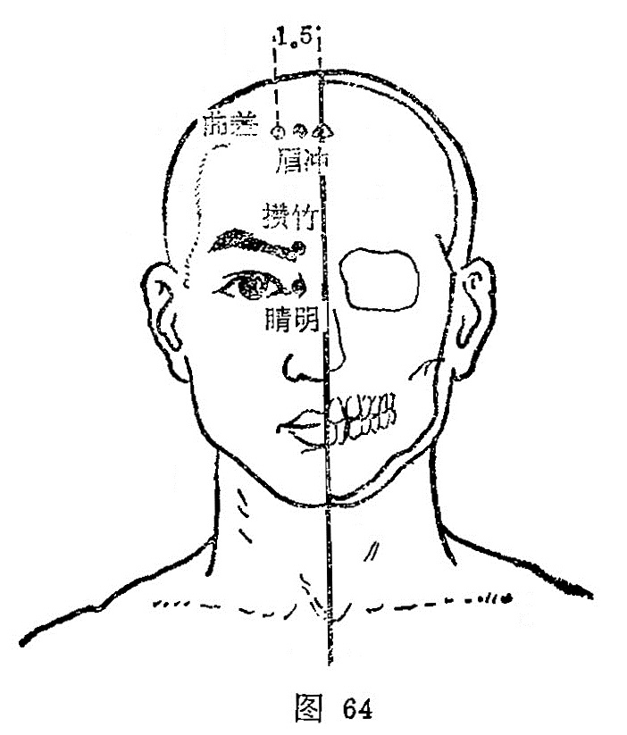

##### 睛明

〔定位〕目内眦旁0.1寸处（图64）。

〔解剖〕在眶内缘，睑内侧韧带中，深部为眼内直肌；有内眦动静脉和滑车上下动、静脉，深层上方有眼动静脉本干；有滑车上下神经，深层为眼神经分支，上方为鼻睫神经。

〔功能〕祛风明目。

〔主治〕目赤肿痛，迎风流泪，眦痒，夜盲，色盲，青盲。

〔刺灸〕嘱病人闭目，医者左手固定眼球，右手刺手用压入式进针，紧靠眶缘直刺0.3〜0.5寸，不宜作大幅度提插、捻转。禁灸。

〔讲述〕见于《甲乙》。别称目内眦、泪孔、泪空。睛指目，即泪珠；明指照。穴在目内眦，主治两目红肿，怕日羞明，一切目疾，针此有明目之效，因名。《甲乙》：治目不明，恶风，百泪出, 僧寒，目痛目眩，内眦赤痛，目𥆨𥆨无所见，眦痒痛，淫肤白翳。《铜人》：治攀睛翳膜覆曈、恶风泪出；目内眦痒痛，小儿雀目，疳眼，大人气眼冷泪，瞳百视物不明，大眦胬肉侵睛。临床常配合谷，点刺太阳出血，清热祛风，泄热解毒，治天行赤眼；配合谷、神门祛风清心治翼状胬肉。配足三里、阴陵泉清湿热，治湿热引起者；配攒竹、瞳子髎舒筋活络，调节眼肌功能，治外斜视；配合谷、太冲治内斜视。凡目系弛缓、脾虚约束失职之斜视，加补合谷、足三里补中益气。配攒竹、太阳、球后治泪囊炎，心火盛加神门，风火盛风池、外关。配行间治气滞雀目；配内关治暴盲。穴属手太阳、足太阳、足阳明、阴跷、阳跷之会，是经气会聚之所，加之睛明位于目内眦，而内眦属血轮，内应于心，心主血脉，五行配火，心气和则火宁内潜，心气盛则火炎浮动，上炎逆行，脉络壅阻，郁于内眦，迫及气轮、风轮、水轮所生目疾，刺此穴泻之能清热明目，散瘀退翳，用补法能益虚明目，故可治一切目疾。

