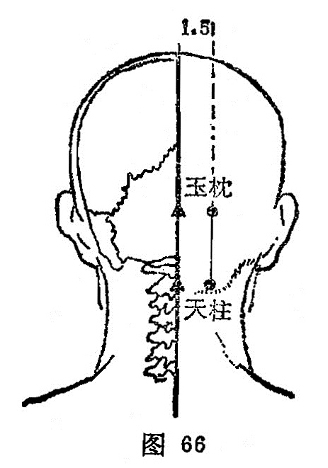

##### 天柱

〔定位〕哑门（督脉)旁开1.3寸，当斜方肌外缘取穴（图66)。

〔解剖〕在斜方肌起始部，深层为头半棘肌，有枕动、静脉干，布有枕大神经干。

〔功能〕疏风，解表，止痛。

〔主治〕头痛项强，眩晕，鼻塞，咽痛，热病，狂痫。

〔剌灸〕直刺0.5〜0.7寸，不宜向内上方深刺。可灸。

〔讲述〕出《灵枢•本输》。天指头言，大椎以上至头为柱骨(颈推），穴在柱骨上端，支持头颅，意示擎天之柱，因名。本穴主要 用治外感发热，项强恶风，以及头晕目眩，狂痫等症。《灵枢•热病》治暴挛痫眩，足不任身。《甲乙》:主眩，头痛重，目如脱，项似拔，狂见鬼，目上反，项直不可以顾，暴挛足不任身，痛欲折，癫疾互引，咽肿难言，目𥆨𥆨赤痛，热病汗不出。临床常配风池治发热无汗；配昆仑治目眩，目欲脱；配大抒治厥逆，头重眩仆；配后溪、绝骨治落枕；配养老治目疾；配束骨治项强多恶风。本穴所以能发汗退热，是因邪犯太阳，伤其肌表，刺此能驱风寒，疏表邪，本穴所以能治头眩目昏，是因目是宗脉之所聚，上液之道，精气不灌则目无所见，剌此能培本扶元，促进精气上灌于目，以增强视觉，达到明目之效。

