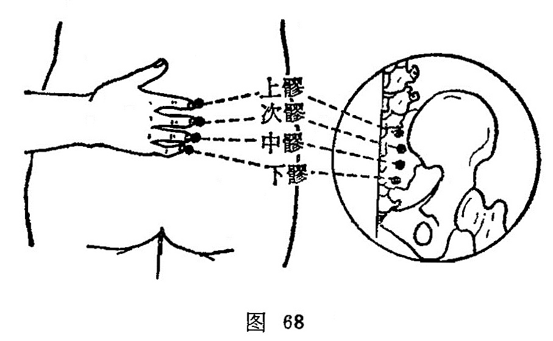

##### 次髎

〔定位〕在骶骨角后上方凹陷处，即第二骶后孔中取穴（图68）。

〔解剖〕在臀大肌起始部，当骶外侧动、静脉后支，布有第二骶神经后支。

〔功能〕健腰膝，调下焦。

〔主治〕腰骶痛，下肢痿痹，二便不利，痛经，月经不调，赤白带下。

〔刺灸〕直刺0.8〜1寸。可灸。

〔讲述〕出《素问•骨空论》。穴在第二骶后孔处，因名。穴属足太阳所结，针刺针感可放散到前阴、肛门、少腹，以及盆腔部，故多用治盆腔疾患。临床常配[合谷](https://www.gmzyjc.com/read/zjs/zjs3.1.1-3-0.1.2.3.4.md)、[足三里](https://www.gmzyjc.com/read/zjs/zjs3.1.1-3-0.1.3.3.36.md)益中气，固脱止溺； 配[关元](https://www.gmzyjc.com/read/zjs/zjs3.2.1-0.1.1.3.4.md)、[肾俞](https://www.gmzyjc.com/read/zjs/zjs3.1.7-8-0.0.1.3.23.md)温肾约胞，治命火不足之遗尿；配[气海](https://www.gmzyjc.com/read/zjs/zjs3.2.1-0.1.1.3.6.md)、[肾俞](https://www.gmzyjc.com/read/zjs/zjs3.1.7-8-0.0.1.3.23.md)益气固肾，束约膀胱治肾气不固之遗尿；配[合谷](https://www.gmzyjc.com/read/zjs/zjs3.1.1-3-0.1.2.3.4.md)、[足三里](https://www.gmzyjc.com/read/zjs/zjs3.1.1-3-0.1.3.3.36.md)益气行水，治癃闭；配[中极](https://www.gmzyjc.com/read/zjs/zjs3.2.1-0.1.1.3.3.md)、[膀胱俞](https://www.gmzyjc.com/read/zjs/zjs3.1.7-8-0.0.1.3.28.md)、[阳陵泉](https://www.gmzyjc.com/read/zjs/zjs3.1.9-12-0.0.3.3.34.md)分利湿热，治热结癃闭；配[关元](https://www.gmzyjc.com/read/zjs/zjs3.2.1-0.1.1.3.4.md)、[太溪](https://www.gmzyjc.com/read/zjs/zjs3.1.7-8-0.0.2.3.3.md)温补肾阳，治肾阳不足之癃闭。用治脱肛，會配[百会](https://www.gmzyjc.com/read/zjs/zjs3.2.2-0.0.1.3.20.md)升提直肠，固摄肛门；用治滞产常配[合谷](https://www.gmzyjc.com/read/zjs/zjs3.1.1-3-0.1.2.3.4.md)，泻[三阴交](https://www.gmzyjc.com/read/zjs/zjs3.1.4-6-0.0.1.3.6.md)能补气行血，缩宫催产。

