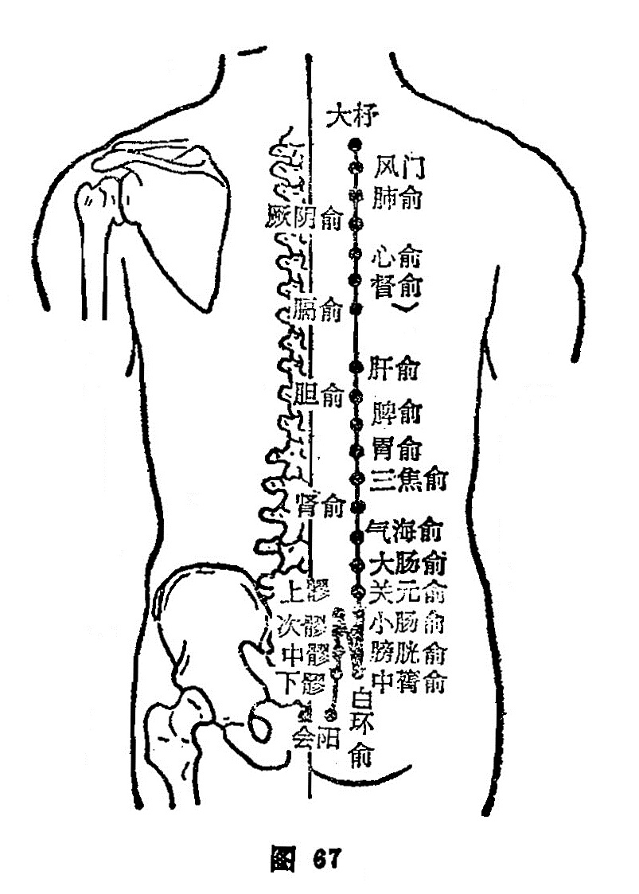

##### 会阳

〔定位〕在尾骨下端，督脉旁开0.5寸处，膝臀位取穴（图67）。

〔解剖〕有臀大肌，臀下动、静脉分支，布有尾神经，深部有阴部神经干。

〔功能〕调下焦，理肛疾。

〔主治〕下元亏虚，阳萎，带下，痔疾，便血，泄泻，痢疾。

〔剌灸〕直刺0.8〜1寸。宜灸。

〔讲述〕见于《甲乙》。别称利机。会有合的含意，穴属膀胱，位居督脉，是督脉经气所生，二脉皆属阳，因名。本穴主要用治：肠澼、便血，以及带下、阳萎之疾。临床常配承山治痔疮便血；配长强治阴部瘙痒；配复溜、束骨治肠澼。

