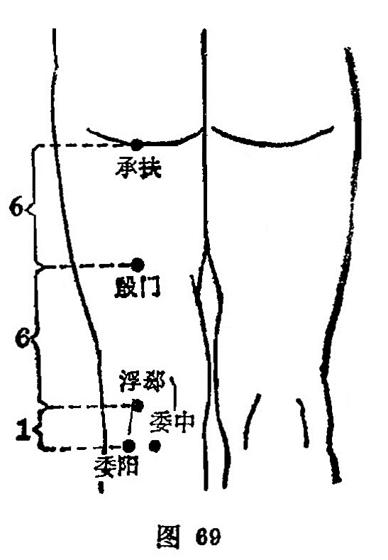

##### 委阳

〔定位〕腘窝横纹外侧端，股二头肌腱内缘，屈膝取穴（图69）。

〔解剖〕在股二头肌腱内侧，有膝上外侧动、静脉；布有股后皮神经，正当腓总神经处。

〔功能〕通三焦，疏水道，初膀胱。

〔主治〕小腹胀，小便不利，腰脊强痛，腿足拘挛疼痛，痿厥不仁。

〔刺灸〕直刺0.5〜1寸。可灸。

〔讲述〕出《灵遍•本输》。委指屈，穴属膀胱，位于委中外侧，外为阳，因名。本穴除治腰脊强痛外，主要用治小便不利，以及癃闭、遗溺之疾。《甲乙》：治胸满膨膨然，实则癃闭，腋下肿，虚则遗溺。临床常配志室、中髎治小便淋沥；配中髎、中极治遗尿；配天池治腋下肿；配膀胱愈、中极、三阴交治乳糜尿；配委中治筋急身热；配殷门治腰痛得俯不得仰。

