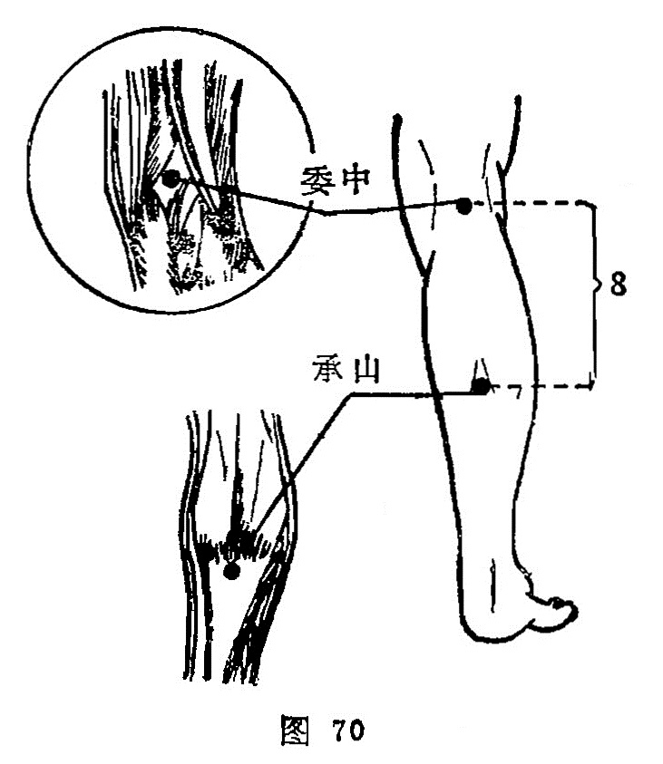

##### 委中

〔定位〕[承山](https://www.gmzyjc.com/read/zjs/zjs3.1.7-8-0.0.1.3.57.md)上8寸，在腘窝横纹中央，于股二头肌腱与半腱肌腱的中间，俯卧取穴（图70）。

〔解剖〕在腘正中，有腘筋膜，皮下有股腘静脉，深层内侧为腘静脉，最深层为腘动脉，布有股后皮神经及胫神经。

〔功能〕凉血泻热，舒筋活络。

〔主治〕腰背膝痛，腘筋拘急，下肢痿痹，半身不遂，腹痛，吐泻，丹毒，疔疮。

〔刺灸〕直刺0.5〜1寸，或用三棱针点刺出血。禁灸。

〔讲述〕出自《灵枢•本输》。别称腘中、郄中、血郄、腿凹。委指屈，穴在腘窝中央正中，取此穴须腘膝弯曲，委而取之，因名，穴属膀胱所入为合，又为血郄，临床除治腰脊强痛外，又可用于霍乱吐泻、疔疮发背等症。用于吐泻腹痛，可于[委中](https://www.gmzyjc.com/read/zjs/zjs3.1.7-8-0.0.1.3.40.md)浅表浮脉刺血，可达凉血泻血之效。临床常配[中脘](https://www.gmzyjc.com/read/zjs/zjs3.2.1-0.1.1.3.11.md)、[天枢](https://www.gmzyjc.com/read/zjs/zjs3.1.1-3-0.1.3.3.25.md)、[内关](https://www.gmzyjc.com/read/zjs/zjs3.1.9-12-0.0.1.3.6.md)止吐泻；配[中脘](https://www.gmzyjc.com/read/zjs/zjs3.2.1-0.1.1.3.11.md)、[内关](https://www.gmzyjc.com/read/zjs/zjs3.1.9-12-0.0.1.3.6.md)、[公孙](https://www.gmzyjc.com/read/zjs/zjs3.1.4-6-0.0.1.3.4.md)畅中宣壅，开窍逐邪。凡腰痛因寒引起配灸[肾俞](https://www.gmzyjc.com/read/zjs/zjs3.1.7-8-0.0.1.3.23.md)；因湿热配[膀胱俞](https://www.gmzyjc.com/read/zjs/zjs3.1.7-8-0.0.1.3.28.md)利湿止痛；配[龈交](https://www.gmzyjc.com/read/zjs/zjs3.2.2-0.0.1.3.28.md)点刺[委中](https://www.gmzyjc.com/read/zjs/zjs3.1.7-8-0.0.1.3.40.md)出血治跌仆闪挫痛；配命门、[肾俞](https://www.gmzyjc.com/read/zjs/zjs3.1.7-8-0.0.1.3.23.md)、[志室](https://www.gmzyjc.com/read/zjs/zjs3.1.7-8-0.0.1.3.52.md)治肾亏腰痛，所以临床上有"腰背[委中](https://www.gmzyjc.com/read/zjs/zjs3.1.7-8-0.0.1.3.40.md)求”的名句。本穴所以能治腰痛，是因膀胱经脉自腰背面来的两条支脉皆下行会于胭中，《灵枢•终始》：“病在腰者，取之腘”。由于穴属血郄，刺出血，多用治瘀症、实症；若体虚，精血不足, 贫血，孕妇，易于出血者慎用，所谓“刺郄中大脉，令人仆脱色”，《素问•刺腰痛》：足太阳脉，令人腰痛引项脊尻背如垂状，刺其郄中，太阳正经出血，舂无见血。指明因经脉阻滞，上下不畅所致腰痛牵引项脊尻背不适，如负重物，凡瘀滞实症，可刺郄中出血，通畅经脉，散滞止痛。
