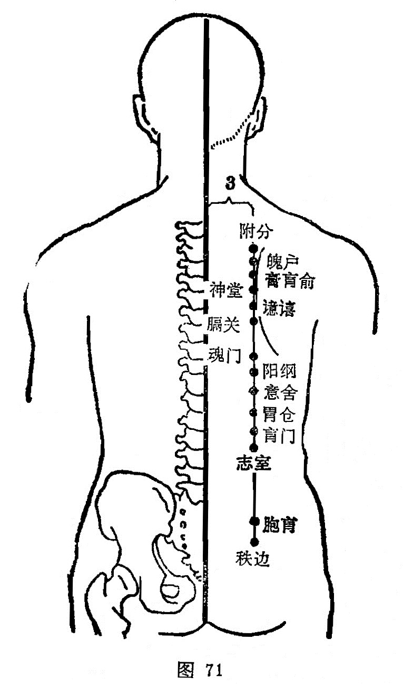

##### 阳纲

〔定位〕在第十胸椎棘突下，中枢（督脉）旁开3寸处（图71）。

〔解剖〕有背阔肌，髂肋肌，第十肋间动、静脉背侧支，布有第九、十胸神经后支外侧支，深层为第十肋间神经干。

〔功能〕利肝胆，清湿热。

〔主治〕胆肝病，肠鸣，腹胀，泄泻，黄疸，消渴。

〔刺灸〕斜刺0.5〜0.8寸。宜灸。

〔讲述〕见于《甲乙》。六腑为阳，统领为纲，穴属膀胱经，位居胆俞旁，适当胃俞、三焦俞、大肠俞、小肠俞、膀胱俞之上，为诸阳之总纲，因名。本穴可助胆俞之清热利胆之功效。临床常配至阳，肝俞，大椎治身热目黄；配魂门、巨阙、大赫治虫痛。

