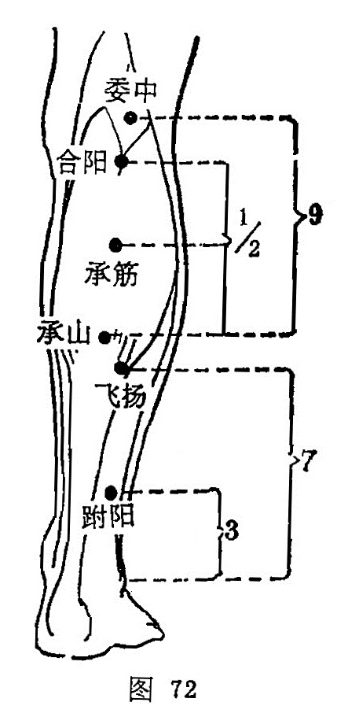

##### 承筋

〔定位〕当合阳与承山之间，于腓肠肌两肌腹中央取穴（图72）。

〔解剖〕在腓肠肌两肌腹之间，有小隐静脉，深层为胫后动、静脉，布有腓肠内侧皮神经，深层为胫神经。

〔功能〕健腰膝，理肛疾。

〔主治〕小腿痛，腰背拘急，痔疾，霍乱转筋。

〔刺灸〕直刺0.5〜1寸。可灸。

〔讲述〕见于《甲乙》。别称直肠、喘肠。承指受，筋指腨肠肌，穴当腨肠中，因名。本穴用治霍乱转筋，小腿麻痹不仁、还可用治痔痛，便秘之疾。临床常配委中、三阴交治下肢麻痹不仁；配大肠俞、支沟治便秘；配束骨、长强治痔痛。

