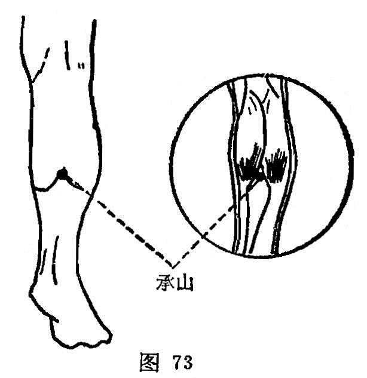

##### 承山

〔定位〕在腓肠肌肌腹下，伸小腿时，当腓肠肌下出现人字纹处（图73）。

   

〔解剖〕在腓肠肌二肌腹交界下端，有小隐静脉，深层为胫后动、静脉；布有腓肠内侧皮神经，深层为胫神经。

〔功能〕舒筋脉，理肛疾。

〔主治〕腰背痛，腿痛转筋，痔疾，便秘，脚气。

〔刺灸〕直刺0.5〜1.5寸。可灸。

〔讲述〕见于《甲乙》。别称鱼腹、肉柱。穴当腨肠下，是处形若山谷之隆起，因名。本穴除治腰背腿足拘挛，寒湿脚足肿痛外，还可用治痔疾，便秘，便血，以 及霍乱转筋之疾。《天星》： 善治腰疼痛，痔疾大便难，脚气并膝肿，辗转战痛痠，霍乱转筋急。临床常配肾俞、委中治腰脊背痛；配长强治肠风下血；配二白、百会治脱肛、痔痛；配中封治霍乱转筋，配太溪治便秘。本穴所以能治便秘、肛疾，是因足太阳的支脉，从腰下贯脊入腘中，加之经别自下腿后侧上行，入于肛门，所谓“九般痔漏最伤人，必须承山效若神”。
