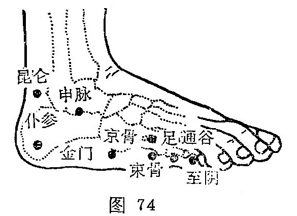

##### 至阴

〔定位〕在足小趾外侧趾甲角旁约0.1寸处（图74）。

〔解剖〕有趾背动脉及趾跖侧固有动脉形成的动脉网；布有趾跖侧固有神经及足背外侧皮神经。

〔功能〕上清头目，下调胎产。

〔主治〕头痛，鼻塞，鼻衄，目痛，足下热，胎位不正，难产，胞衣不下。

〔刺灸〕浅刺0.1〜0.2寸。宜灸。

〔讲述〕出《灵枢•本输》。至有尽、到的含义，足太阳膀胱经气由此输入少阴，因名。本穴为阴井，除主头痛、鼻衄、项强、目翳诸疾外，还可用治滞产，兼能矫正胎位。临床常配太阳、列缺治偏头痛，配风池、天柱、太阳治头项痛，配风池、瞳子髎、攒竹治目疾。《肘后歌》：面目之疾针至阴。用于难产，胞衣不下, 多用灸法。近年灸至阴矫正胎位，疗效显著，一般采用温和灸15分钟左右即可。此乃因穴属膀胱井穴，太阳膀胱经上起面部，经身体背侧，脊柱两旁下腰骶，直到足小趾外侧，当至阴得到刺灸之后，能使之产生相应的生理器官兴奋活动，尤其是子宫本身的活动，从而影响胎儿的活动，达到矫正胎位的目的。特别是妊妇腹壁紧张度适中者效果良好。

