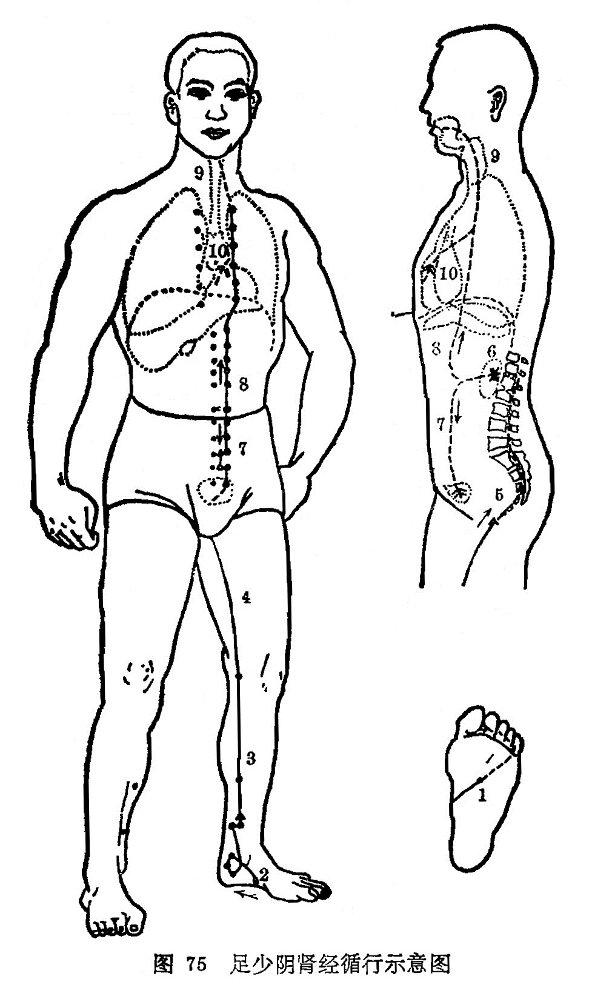

#### （一）分布络属

分布径路：受膀胱经之交，从足小趾下端起始，斜行走向足底心涌泉，出行到足舟骨粗隆的下面，沿着内踝的后边，分出进入脚跟中，向上到腓肠肌内，上行沿腘窝内缘和大腿内侧后缘， 贯穿脊柱里面，归属肾经，联络膀胱。

它的主干，从肾出来，向上穿过肝和膈肌，进入肺，沿着喉咙，到舌根两旁。

它的支脉，从肺出来，联络心，脉气注入于胸中，交给手厥阴心包经。

络属脏腑：属肾，络膀胱。

经过器官：舌，喉咙，联系肝、肺、心、脊髓。

本经腧穴：

八足少阴肾经属，内侧后缘足走腹。

足心凹陷是**涌泉**，大骨之下取**然谷**。

**太溪**内踝后陷中，**照海**踝下四分逐。

**水泉**跟下内侧边，**大钟**溪泉踵筋间。

 **复溜**踝上二寸取，**交信**溜前五分详。

踝上五寸寻**筑宾**，**阴谷**膝内两筋安。

上从中行开半寸，**横骨**平取曲骨边。

**大赫气穴**并四满，**中注肓俞**亦相连，

**商曲**又凭下脘取，**石关阴都通谷**言。

**幽门**适当巨阙侧，诸穴相距一寸间。

再从中行开二寸，六穴均在肋间藏。

**步廊**却近中庭穴，**神封灵墟神藏**兼。

或**中俞府**平璇玑，相隔一肋仔细研。

图解：肾足少阴之脉，①起于小趾之下，斜走向足心，出于然谷下，②循内踝之后，别入跟中，③以上腨内，出腘内廉，④上股内后廉，⑤ 贯脊，⑥属肾，⑦络膀胱。其直者，⑧从肾上贯肝膈，入肺中，⑨循喉咙，挟舌本，其支者，⑩从肺出络心，注胸中（《灵枢•经脉》)。
