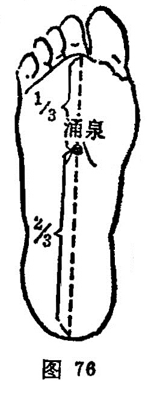

##### 涌泉

〔定位〕踡足时，在足心前1/3的凹陷处（图76）。

〔解剖〕在足第二、三跖骨间，跖腱膜中，内有屈趾短肌腱，屈趾长肌腱，第二蚓状肌，深层为骨间肌，足底动脉弓；布有足底内侧皮神经。

〔功能〕开窍，苏厥，泄热，降逆。

〔主治〕晕厥，目眩，失眠，失音，中风，癫痫，癔病，小儿惊风，头顶痛，足心热痛。   

〔刺灸〕直刺0.3〜0.5寸。可灸。

〔讲述〕出《灵枢•本输》。别称地 冲。出处为涌，又形容小水从下而上；水自地出为泉。穴属肾经，昔有以足象地，穴居足心，为肾之井，是脉气出所，因名。本穴的功能，根据 “实泻其子”和“病在脏取之井”的法则，多用治厥、闭、痫、狂以及头痛、眩晕、脏燥诸疾。临床常配[太冲](https://www.gmzyjc.com/read/zjs/zjs3.1.9-12-0.0.4.3.3.md)、[风池](https://www.gmzyjc.com/read/zjs/zjs3.1.9-12-0.0.3.3.20.md)、[百会](https://www.gmzyjc.com/read/zjs/zjs3.2.2-0.0.1.3.20.md)治头痛、眩晕，肝亢，有引火下行以潜其阳之力；凡阴虚者加[复溜](https://www.gmzyjc.com/read/zjs/zjs3.1.7-8-0.0.2.3.7.md)育阴潜阳。配[人中](https://www.gmzyjc.com/read/zjs/zjs3.2.2-0.0.1.3.26.md)，[百会](https://www.gmzyjc.com/read/zjs/zjs3.2.2-0.0.1.3.20.md)开窍醒神，治中风卒倒；凡阳闭加[丰隆](https://www.gmzyjc.com/read/zjs/zjs3.1.1-3-0.1.3.3.40.md)豁痰，[太冲](https://www.gmzyjc.com/read/zjs/zjs3.1.9-12-0.0.4.3.3.md)平肝；阴闭可灸[百会](https://www.gmzyjc.com/read/zjs/zjs3.2.2-0.0.1.3.20.md)。配[人中](https://www.gmzyjc.com/read/zjs/zjs3.2.2-0.0.1.3.26.md)、[曲泽](https://www.gmzyjc.com/read/zjs/zjs3.1.9-12-0.0.1.3.3.md)、[委中](https://www.gmzyjc.com/read/zjs/zjs3.1.7-8-0.0.1.3.40.md)出血能清暑热，开窍闭治暑厥； 凡因气者加[内关](https://www.gmzyjc.com/read/zjs/zjs3.1.9-12-0.0.1.3.6.md)理气开窍，血厥加[三阴交](https://www.gmzyjc.com/read/zjs/zjs3.1.4-6-0.0.1.3.6.md)理气活血，痰厥加[天突](https://www.gmzyjc.com/read/zjs/zjs3.2.1-0.1.1.3.20.1.md)降痰开窍；配[神门](https://www.gmzyjc.com/read/zjs/zjs3.1.4-6-0.0.2.3.7.md)、[合谷](https://www.gmzyjc.com/read/zjs/zjs3.1.1-3-0.1.2.3.4.md)、[丰隆](https://www.gmzyjc.com/read/zjs/zjs3.1.1-3-0.1.3.3.40.md)清心窍，涤痰治癫狂发作；配[人中](https://www.gmzyjc.com/read/zjs/zjs3.2.2-0.0.1.3.26.md)、[后溪](https://www.gmzyjc.com/read/zjs/zjs3.1.4-6-0.0.3.3.3.md)开窍定痫治五痫；配[太冲](https://www.gmzyjc.com/read/zjs/zjs3.1.9-12-0.0.4.3.3.md)、[公孙](https://www.gmzyjc.com/read/zjs/zjs3.1.4-6-0.0.1.3.4.md)平降逆冲治奔豚气。《素问•刺禁论》：刺足少阴脉，重虚出血，为舌难以言。因足底血管丰富，若以粗针；易于出血，使肾气更虚，而肾脉上循喉咙，挟舌本，故肾气虚可发生舌难言，所以说“[涌泉](https://www.gmzyjc.com/read/zjs/zjs3.1.7-8-0.0.2.3.1.md)刺深杀人”，“令人百神俱散”。现今以毫针治实证，不会发生意外。
