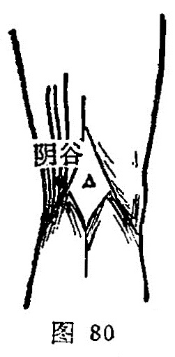

##### 阴谷

〔定位〕当腘窝内侧，与委中相平，在半腱肌腱与半膜肌腱之间，屈膝取穴（图80）。

〔解剖〕在半腱肌和半膜肌腱之间，有膝上内侧动、静脉；布有股内侧皮神经。

〔功能〕益元壮肾。

〔主治〕阳萎，疝痛，崩漏，月经不调，小便不利，阴中痛，膝股内侧痛。

〔刺灸〕直刺0.8〜1寸。可灸。

〔讲述〕出《灵枢•本输》。深处为谷，穴属肾经，肾为阴脏，位居下肢后侧腘内凹陷处，因名。穴属合水，临床常配肾俞、关二元、三阴交治阳萎不举，配水道、阴陵泉治小便不通，配蠡沟治阴痒，配然谷、复溜治流涎，配膝眼、鹤顶治膝肿痛，配中极，复溜治小便赤痛，配水道治水肿。
