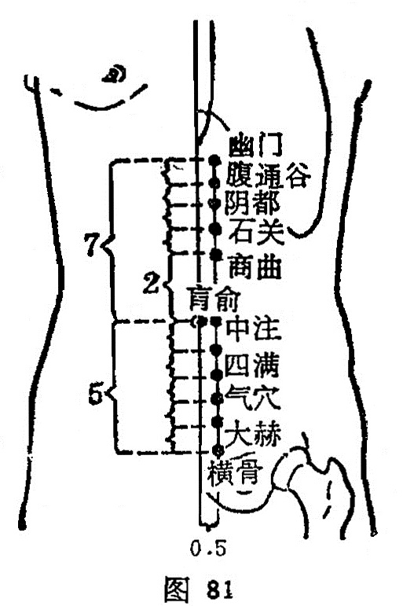

##### 大赫

〔定位〕脐下4寸,旁开0.5寸处（图81）。

〔解剖〕在腹内外斜肌腱膜，腹横肌腱膜及腹直肌中，有腹壁下动、静脉的肌支，第12肋间神经及髂腹下神经的分支。

〔功能〕益肾气，理下焦。

〔主治〕遗精，阳萎，阴茎痛，阴挺，带下。

〔刺灸〕直刺 0.8〜1.2寸。可灸。

〔讲述〕见于《甲乙》。别称阴维、阴关。赫有显耀之意，穴属肾经，内临子宫，妇人妊娠之后，此处突起显而易见，因名。穴属冲脉、足少阴之会。《甲乙》：用治男子精溢，阴上缩，女子赤淫。临床常配然谷治精溢阴萎，配中封治萎厥；配肾俞、关元、三阴交、行间治阴萎缩痛、少腹胀痛。

