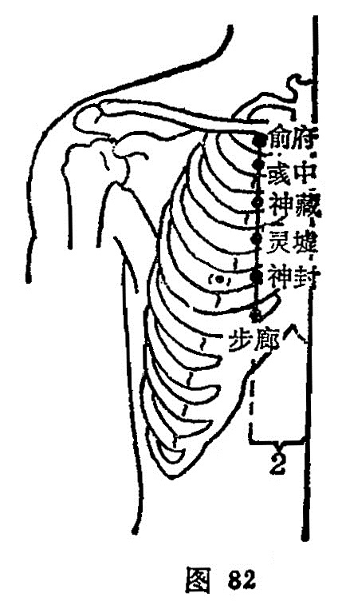

##### 彧中

〔定位〕在第一肋间隙，华盖(任脉）旁开2寸处取穴（图82）。

〔解剖〕在第一肋间隙，胸大肌中，有肋间外韧带及肌间肌，有第一肋间动、静脉；布有第一肋间神经皮支，深层为第一肋间神经，皮下有锁骨上神经前支。

〔功能〕止咳，平喘，祛痰。

〔主治〕咳嗽，气喘，痰壅，胸胁胀满，不嗜食。

〔刺灸〕针刺或平刺 0.5〜0.8寸。可灸。

〔讲述〕见于《甲乙》。别称或中。彧指郁，有繁华茂盛之意，穴近心脏，横平华盖，下有神藏，肾经脉气至此，内郁神明之脏，因名。《甲乙》：治咳逆上气，涎出多唾喘悸，坐卧不安之疾。临床常配肺俞、膏肓、膻中治咳嗽喘息，配内关治心悸不安，配云门治胸痛。

