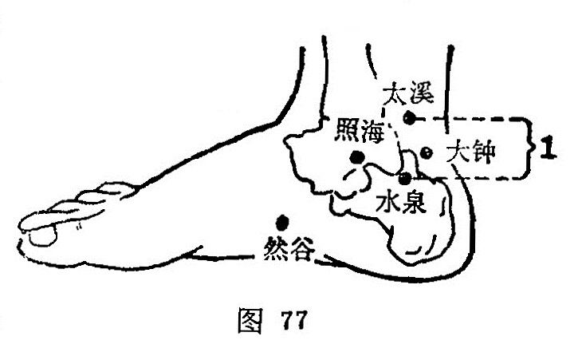

##### 太溪

〔定位〕内踝与跟腱之间凹陷中，平内踝尖取穴（图77）。

〔解剖〕有胫后动、静脉；布有小腿内侧皮神经，当胫神经通过处。

〔功能〕滋阴补肾，调理任冲。

〔主治〕头痛，咽痛，眩晕，失眠，齿痛，耳聋，咳血，气喘，消渴，月经不调，遗精，阳萎，小便频数，腰脊痛，内踝肿痛。

〔刺灸〕直刺0.5〜0.8寸。可灸。

〔讲述〕出《灵枢•本输》。别称吕细。太指甚，小水为溪，肾井出于涌泉，通过然谷，聚流成溪，并由此会注百川入海，因名。穴属输、原，主治肾病和肾有关的脏腑病变。临床常配太冲、风池、百会滋阴潜阳，镇肝熄风，治肾水亏虚，风阳上扰之头痛、眩晕症；配复溜、关元滋补肾阴，治肾阴不足，髓海空虚之眩晕症；配三阴交、听宫补益精血，肾气通于耳，宣通耳窍，治肾虚耳鸣。肾之津液出于舌下，配廉泉治舌音不能言和流涎；配颊车、下关治牙痛，这是因为肾主骨，齿为骨之余，当肾阴不足，虚阳上亢时，就会发生齿痛，齿脆不坚，刺补肾之原穴可益背固齿；配复溜、气海、太渊补肾纳气治肾不纳气；配肾俞、气海补益肾气，束约膀胱治遗尿；配三阴交、命门、肾俞滋肾培元，固约任带治带下；配少商治咽干；配列缺、太渊治咯血；配昆仑治下肢痹痛；配风池、木冲治耳性眩晕；配志室治肾虚腰痛。

