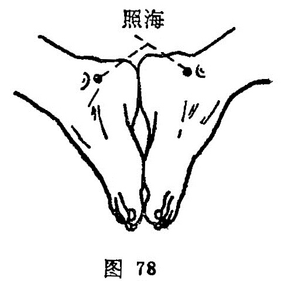

##### 照海

〔定位〕内踝下缘凹陷处；或两脚心相对，当内踝下呈凹陷处是穴（图78）。

〔解剖〕在𧿹趾外展肌止点，后方有胫后动，静脉，布有小腿内侧皮神经，深部为胫神经本干。

〔功能〕滋阴补肾，利咽明目。

〔主治〕咽干，嗜卧，惊恐不宁，梅核气，暴喑，痫症，失眠，目赤肿痛，月经不调，赤白带下，阴挺，阴痒，癃闭。

〔刺灸〕直刺0.5〜0.8 寸。可灸。

〔讲述〕见于《甲乙》。别称阴跷。照者光明所及，海指百川之会，本穴主治目疾之广似海，加之足少阴肾气至此会聚，因名。穴属阴跷脉所生，为八脉交会穴之一。临床用于经带之疾。由于肾之阴液，上养咽喉，开窍于舌，故凡肾水不足，虚火上炎，补本穴能益水泄火，使达清咽利膈之效。水亏肝旺，目失滋养则视力减退，刺此能滋水益肝以养目。穴系阴跷所生，故妇科之经带、阴挺，刺此能补肾阴，滋肾水，调经带；又凡痫症夜发者，刺此能止。临床常配列缺治咽痛，配归来、关元治阴挺，配蠡沟治阴痒，配大敦疗疝痛，配支沟通便秘，配内关治胸胁痛，配列缺治肺系病。
