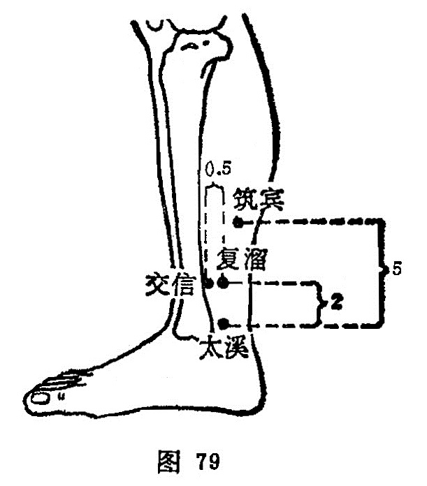

##### 复溜

〔定位〕太溪穴直上2寸。跟腱前缘取穴（图79）。

〔解剖〕在比目鱼肌下端移行于跟腱处之内侧，前方有胫后动、静脉；布有腓肠内侧皮神经和小腿内侧皮神经，深层为胫神经。

〔功能〕清热利尿，滋阴补肾。

〔主治〕水肿，泄泻，腹鸣，腹胀，足痿，自汗，盗汗，热病汗不出。

〔刺灸〕直刺0.5〜1寸。可灸。

〔讲述〕出《灵枢•本输》。别称伏白、外命。重返为复，肾脉至太溪回转之后，复直流向上，故名。穴属绎金穴，为本经之母穴；由于肾为水火之脏，故凡肾阴不足，出现水不涵木，肝阳上亢，以及水不上承，心肾不交，子盗母气，肺阴耗伤，补其母能滋肾水、益 肝木、调心肾。临床常根据肾气通于耳，配太溪、耳门、三阴交补益精血，治肾虚耳鸣聋；根据肾脉挟舌本，上系于舌，络于横骨，终于会厌，配通里、太渊治音哑不能言；根据金水相生的法则，配肺俞太渊滋补肺肾，治燥热伤津之咳嗽；根据下消宜滋其肾的法则，配太溪、太渊治下消；根据肾水不足，不能上济于心，心火扰动，迫液外泄，配阴郄清泻心火，配复溜滋补肾水治盗汗；根据髓海不足则脑转耳鸣，配肾俞、太溪补肾益脑治眩晕，凡肝亢加太冲平肝阳，头风加风池以熄风；根据脑为髓海，资生于肾，震伤易见痛、眩、耳鸣、失眠、心悸、健忘、善恐等，可配太溪、肾俞补肾健脑，配神门、心俞交通心肾。

