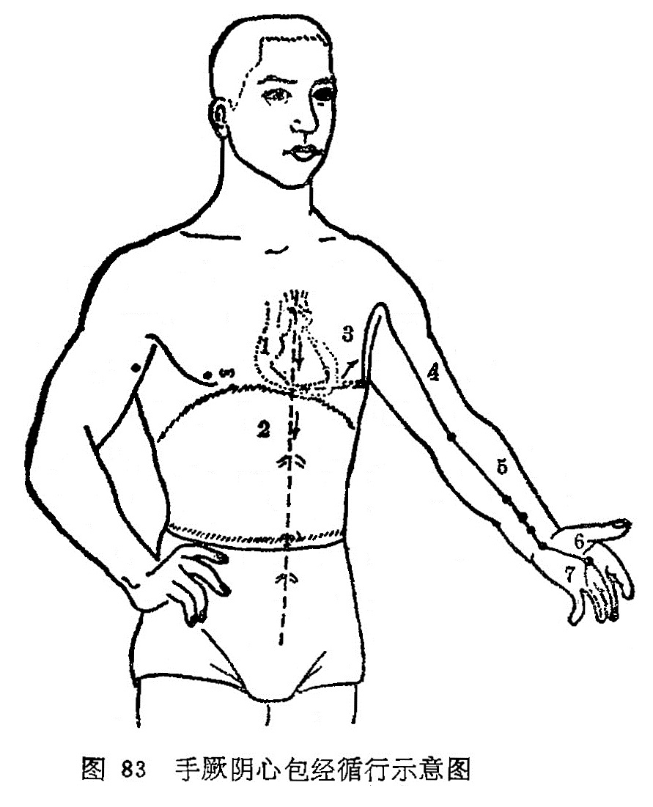

#### （一）分布络属

分布径路：受足少阴之交，从胸中起，出来归属于心包络，向下穿过膈肌，经历而联络胸部（上焦）、上腹（中焦）、下腹（下焦）三焦。

图83  手厥阴心包经循行示意图

图解：心主手厥阴经之脉，①起于胸中，属出心包络，下膈，②历经三焦。其支者，③循胸出胁，下腋3寸，上抵腋下，④循臑内，行太阴、少阴之间，⑤入肘中，下臂行两筋之间，⑥入掌中，循中指出其端。其支者，⑦别掌中，循小指次指出其端（《灵枢·经脉》）。

它的外行支脉，沿胸浅出胁肋部当腋下3寸处，向下走到腋窝下，沿上肢内侧，行于手太阴、少阴二经之中间，进入手掌中，沿中指桡侧，出中指之端。

它的分支，从手掌中央分出，沿无名指出指端，交给手少阳三焦经。

络属脏腑：属心包，络三焦。

本经腧穴：

九心包络手厥阴，前正中线诸穴匀。

**天池**乳旁四肋取，**天泉**腋下二寸循。

**曲泽**肘内横纹上，**郄门**去腕五寸凭。

**间使**腕后方三寸，**内关**掌后二寸停。

掌后横纹**大棱**在，尺桡骨间陷中扪。

**劳宫**屈指掌心取，中指末端**中冲**生。
