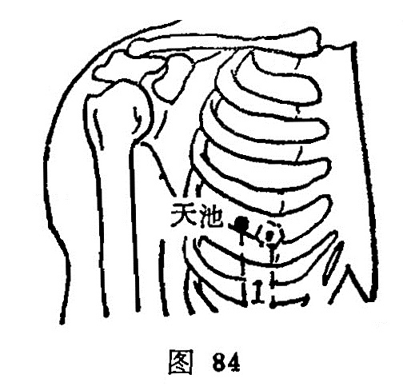

##### 天池

〔定位〕在乳头外侧1寸，第四肋间隙取之（图84）。

〔解剖〕在胸大肌外下部，胸小肌下部起端，深层为第四肋间内外肌，有胸腹壁静脉，胸外侧动、静脉分支，布有胸前神经肌支及第四肋间神经。

〔功能〕消热除烦，散瘀通乳。

〔主治〕胸满，肋痛，咳嗽，气喘，痰多，腋肿，瘰疬乳病。

〔刺灸〕斜刺0.3～0.5寸，不可深剌。可灸。

〔讲述〕出《灵枢·本输》。别称天会，上部为天，储水之处为池，穴当乳旁，乳峰似山巅，有乳涌出，状若天池因名。穴属手厥阴，足少阳之会，《甲乙》：治寒热胸满，头痛，腋下肿，上气，胸中有声，喉中鸣。《十金翼》：主颈漏。临床常配支沟治胸胁痛，配膻中、乳根、少泽治乳病，配委阳治肿；配心俞、内关、厥阴俞治胸痛，心烦和心痛。穴当胸侧，内容心肺，宜斜平浅刺，不可直深刺，《素问·刺禁论》：刺腋下胁回内陷令人咳。

