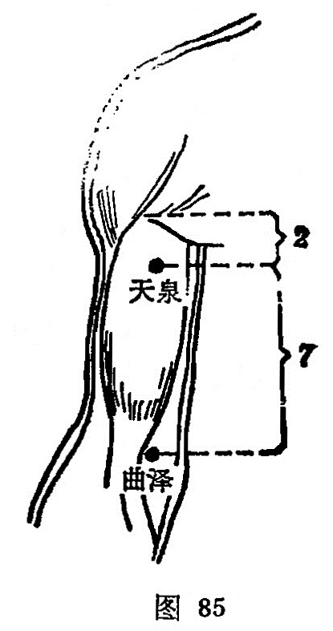

##### 天泉

〔定位〕腋前纹头下2寸，当肱二头肌的长，短头之间，伸臂仰掌取之（图85）。

〔解剖〕在肱二头肌的长、短头之间，有肱动静脉肌支，为臂内侧皮神经及肌皮神经分布处。

〔功能〕宽胸理气，疏通经络。

〔主治〕胸胁胀满，心痛，咳嗽，臂内侧疼痛。

〔刺炙〕直刺0.5～1寸。可灸。

〔讲述〕见于《甲乙》。别称天温。上部为天，水之出处为泉，此穴上接[天池](https://www.gmzyjc.com/read/zjs/zjs3.1.9-12-0.0.1.3.1.md)，位于臂部上端，脉气从此流行，因名。本穴除主臂部内侧疼痛外，还可用治胸胁支满、咳逆心痛之疾。《铜人》：主心痛，胸胁支满，咳逆，鹰臂胛间臂内廉痛。《六集》：治咳逆心胸烦满，胁下支痛，臂内廉痛，肘中挛急。临床常配[腕骨](https://www.gmzyjc.com/read/zjs/zjs3.1.4-6-0.0.3.3.4.md)治肩臂痛，配[中府](https://www.gmzyjc.com/read/zjs/zjs3.1.1-3-0.1.1.3.1.md)治胸满咳逆，惟《甲乙》主石水，足不收；痛不可以行。
