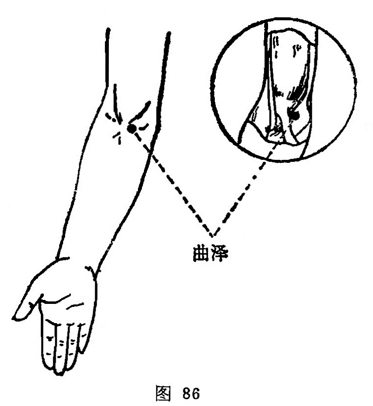

##### 曲泽

〔定位〕仰掌，肘部微屈，在肘横紋上肱二头肌腱的尺侧取穴（图86）。

〔解剖〕在肱二头肌腱尺侧，当肱动、静脉处；布有前臂内侧皮神经及正中神经本干。

〔功能〕清热镇痉，降逆止呕。

〔主治〕心痛，心悸，胃痛，呕吐，身热，烦渴，肘中痛，上肢颤动，转筋。

〔刺炙〕直刺0.8～1寸，或用三棱针点刺出血。可灸。

〔讲述〕出《灵枢·本输》。曲有弯曲之意，水之所归为泽，穴属合水，正当肘内，微曲其肘始得其穴，因名。本穴除主肘痛、挛、拘急，可疏筋脉外，主要用治心胸痛、心悸烦、吐泻烦渴之疾，有通心络，除烦热，降逆止呕之效。《甲乙》治心澹澹然善惊，身热，烦心，口干，手清，逆气，呕血时瘈，善摇头，颜青，汗出不过肩，伤寒温病。《六集》：治九种心痛及风冷臂痛肘痛。临床常配[内关](https://www.gmzyjc.com/read/zjs/zjs3.1.9-12-0.0.1.3.6.md)、[间使](https://www.gmzyjc.com/read/zjs/zjs3.1.9-12-0.0.1.3.5.md)、[少府](https://www.gmzyjc.com/read/zjs/zjs3.1.4-6-0.0.2.3.8.md)治心胸疾患，配[少商](https://www.gmzyjc.com/read/zjs/zjs3.1.1-3-0.1.1.3.10.1.md)治血虚口渴，配[章门](https://www.gmzyjc.com/read/zjs/zjs3.1.9-12-0.0.4.3.13.md)治口干，配[鱼际](https://www.gmzyjc.com/read/zjs/zjs3.1.1-3-0.1.1.3.10.md)、[神门](https://www.gmzyjc.com/read/zjs/zjs3.1.4-6-0.0.2.3.7.md)治呕血。配[委中](https://www.gmzyjc.com/read/zjs/zjs3.1.7-8-0.0.1.3.40.md)点剌出血治吐泻心烦，中暑高热。
