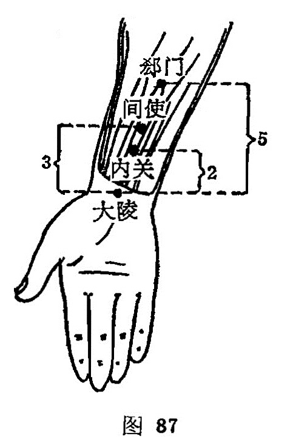

##### 间使

〔定位〕在腕横纹上3 寸，掌长肌腿和挠侧腕屈肌胱之间（图87）。

〔解剖〕在桡侧腕屈肌腱与掌长肌腱之间，有屈指浅肌，深层为屈指深肌；有前臂正中动、静脉，深层为前臂掌侧动、静脉；布有前臂内侧皮神经，前臂外侧皮神经，共下为正中神经掌皮支，最深层为前臂掌侧骨间神经。

〔功能〕宁心安神；和胃祛痰。

〔主治〕癫狂，痫证，脏躁，郁证，心痛，心悸，胃痛，呕吐，烦躁，疟疾，肘挛，臂痛。

〔刺灸〕直刺0.5-1 寸。可灸。

〔讲述〕出《灵·本输》。别称鬼营。间，有当中、间隙之意；使，有传递的含意。穴属心包，为心之臣使，穴居两筋之间，为本经之行所，经气从此传递，因名。本穴除主心痛、胃痛、疟疾外，还可用治癫狂、痫癔等神志病。《甲乙》：治热病烦心，善呕，胸中澹澹，卒心中痛，善悲而惊狂。《千金》：治狂邪发无常，狂言妄语。《金鉴》：治脾寒证，九种心痛，脾痛，疟疾口渴及瘰病久不愈。临床常配内关、心俞治胸心痛，配人中治邪癫，配后溪、合谷治卒狂，配大椎、风池治疟疾，配心俞、膻中治心悸不宁。

