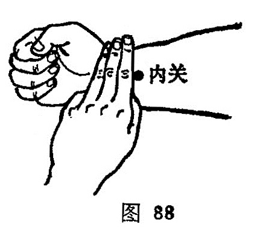

##### 内关

〔定位〕在腕横纹上2 寸，掌长肌腱和桡侧腕屈肌腱之间；或腕横纹上三横指处（图88） 。

〔解剖〕同间使穴。

〔功能〕宁心安神，理气止痛。

〔主治〕心痛，心悸，胸胁痛，胃痛，呕吐，呃逆，癫狂，痫证，郁证，不寐，中风，热病，月经不调，产后血晕，肘臂掌痛。

〔刺灸〕直刺0.5-1寸。可灸。

〔讲述〕出《灵枢·经脉》。穴属心包经，位于前臂内侧，适当关脉后方，又因此穴为心主别络，由此通达表里二经，因名。穴属心包络穴，别走手少阳，又为八脉交会穴之一，通于阴维，故主治功能较广，“胸胁内关谋”，为五总穴之一。主治胃、心、心包以及情志失和，气机阻滞所致的脏腑、器官、肢体诸疾。尤对实中满的实证刺之有宽胸利膈之效。临床常配太冲、期门、中脘疏肝和胃，理气降逆，治胁痛腑胀；配行间、上脘清泻肝火，和胃调中，治气郁化火，胃失和降之疾；配心俞、神门理气通络，补益心气，治心脉痹阻，心络挛急之绞痛；配三阴交、合谷化瘀通络，益气行血治心痛；配关元、神门、合谷温阳救逆，益气复脉，治阳虚心脉痹阻，心络挛急之心痛；配心俞、太冲、复溜育阴潜阳，通畅心络，治气阴两虚之心痛。所以《灵枢·经脉》说：手心主之别，名曰内关。心系实则心痛。加之内关通于阴维，阴维系于足太阴、少阴和厥阴经，并会于任脉，阴维为病苦心痛。《素问·脏气法时论》也说：心病者，胸中痛，胁支满，胁下痛，膺背肩胛间痛，两臂内痛。近代研究证明“海特资氏过敏区”，恰当手少阴心经和手厥阴心包经的循行径路，因而本穴有通畅心络，理气行血之效。由于包络系心之外膜，络为膜外气血通行之处，心主血脉，又主神明，外邪袭之，心包代其受损，故内关又可用于神志病。临床常配太冲、神门安心神，疏肝气，治悲伤欲哭之脏躁；配丰隆、神门宁心神，逐痰涎，治癔病狂躁。除此之外，凡食滞呕吐，配公孙、中脘化滞和胃，止呕，配丰隆、公孙、中院化痰降逆止呕，配太冲、公孙疏肝和胃，降逆止呕。凡暑热感受秽浊，干扰胃腑，浊气上逆作呕者，配金津、玉液、曲泽出血可清暑热、止呕吐。

近代研究证明，刺内关可使胰腺炎患者的血清淀粉酶迅速下降，并对心率有调节作用。
