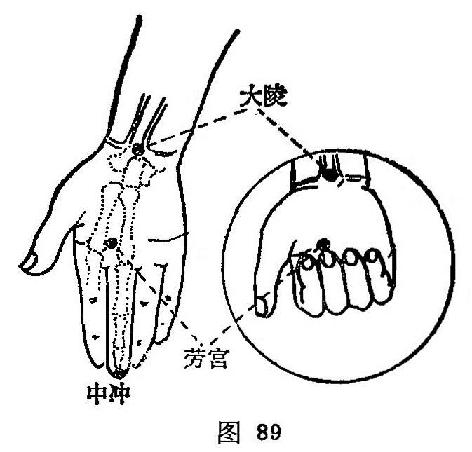

##### 中冲

〔定位〕在手中指尖端中央，去爪甲如韭叶陷中（图89）。

〔解剖〕有指掌侧固有动、静脉所形成的动、静脉网，为正中神经之指掌侧固有神经分布处。

〔功能〕开窍醒神，清心泻热。

〔主治〕中风，中暑，昏厥，惊风，热病，心痛，舌强肿痛，失语，谵语妄言。

〔刺灸〕浅刺0.1寸，或用三棱针点刺出血。

〔讲述〕出《灵枢·本输》。中指中指，又指正中；冲有动的含意。人体井穴皆位于指趾侧面，惟心包井穴位于中指尖端正中，心脉从中指直而冲出，因名。病在脏取之井，诸井皆有开窍泻热之力；加之心包代心用事，心主神明，故刺中冲对卒然昏倒，不省人事诸疾，可收益心气，醒神志之效。临床常配人中、内关、百会苏厥醒神，通关开窍，恢复神志。《玉龙歌》：“中风之症症非轻，中冲二穴可安宁，先补后泻如无应，再刺人中立便轻。”其它配廉泉治舌下肿痛；配命门治身热如火，头痛如破；配商阳治耳聋时不闻音。

本穴定位，有说在手中指之端，有说在手中指廉。今据《甲乙》定在手中指之端。

